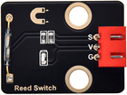
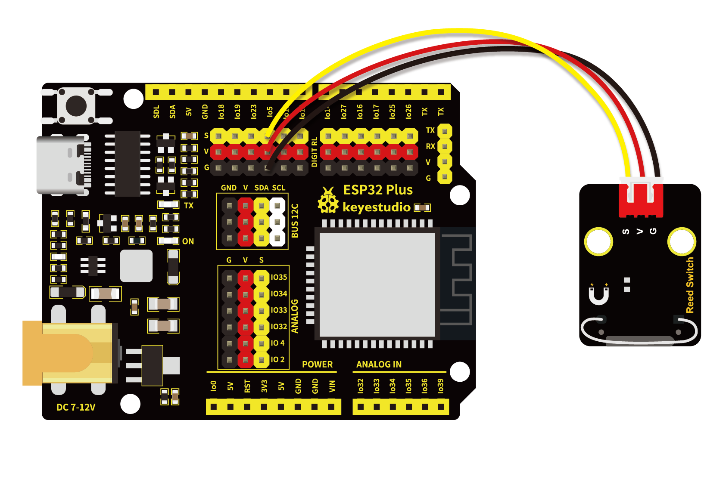
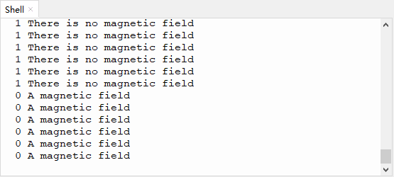

# 第十五课 干簧管检测附近磁场

## 1.1 项目介绍

在这个套件中，有一个Keyes 干簧管模块，它主要由一个MKA10110 绿色磁簧元件组成。簧管是干式舌簧管的简称，是一种有触点的无源电子开关元件，具有结构简单，体积小便于控制等优点。它的外壳是一根密封的玻璃管，管中装有两个铁质的弹性簧片电板，还灌有一种惰性气体。

实验中，我们通过读取模块上S端高低电平，判断模块附近是否存在磁场；并且在“Shell”窗口上显示测试结果。

---

## 1.2 模块参数

工作电压 : DC 3.3 ~ 5V 

电流 : 50 mA

最大功率 : 0.3 W

工作温度 ：-10°C ~ +50°C

输出信号 : 数字信号

尺寸 ：32 x 23.8 x 7.4 mm

定位孔大小：直径为 4.8 mm

接口 ：间距为2.54 mm 3pin防反接口

---

## 1.3 模块原理图


一般状态下，玻璃管中的两个由特殊材料制成的簧片是分开的，此时信号端S被电阻R2上拉为高电平，LED熄灭。当有磁性物质靠近玻璃管时，在磁场磁力线的作用下，管内的两个簧片被磁化而互相吸引接触，簧片就会吸合在一起，使结点所接的电路连通，即信号端S连通GND，此时LED点亮。外磁力消失后，两个簧片由于本身的弹性而分开，线路也就断开了。该传感器就是利用元件这一特性，搭建电路将磁场信号转换为高低电平变换信号。

---

## 1.4 实验组件

|  |  |        |  |
| ------------------------ | ------------------------ | ---------------------------- | --------------------- |
| ESP32 Plus主板 x1        | Keyes 干簧管模块 x1      | XH2.54-3P 转杜邦线母单线  x1 | USB线  x1             |

---

## 1.5 模块接线图



---

## 1.6 在线运行代码

打开Thonny并单击，然后单击“**此电脑**”。

选中“**D:\代码**”路径，打开代码文件''**lesson_15_Reed_Switch**"。

```python
from machine import Pin
import time

ReedSensor = Pin(5, Pin.IN)
while True:
    value = ReedSensor.value()
    print(value, end = " ")
    if value == 0:
        print("A magnetic field")
    else:
        print("There is no magnetic field")
    time.sleep(0.1)
```

---

## 1.7 实验结果

按照接线图正确接好模块，用USB线连接到计算机上电，单击来执行程序代码。代码开始执行。

拿一块带有磁性的物体靠近干簧管模块，当模块检测到磁场时，value值为0且模块上的红色LED点亮，“Shell”窗口打印出“**<u>0 A magnetic field</u>**”；没有检测到磁场时，value值为1，模块上红色LED熄灭，“Shell”窗口打印出“**<u>1 There is no magnetic field</u>**”。



---

## 1.8 代码说明

 此课程代码与第七课代码类似，这里就不多做介绍了。
