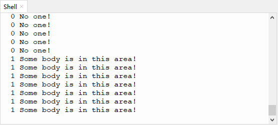

# 第十五课 附近有人吗

## 1.1 项目介绍

在这个套件中，有一个Keyes 人体红外热释传感器，它主要由一个RE200B-P传感器元件组成。它是一款基于热释电效应的人体热释运动传感器，能检测到人体或动物身上发出的红外线，配合菲涅尔透镜能使传感器探测范围更远更广。

实验中，通过读取模块上S端高低电平，判断附近是否有人在运动；并且在串口监视器上显示测试结果。

---

## 1.2 模块参数

工作电压 : DC 5 ~ 15V 

工作电流 : 50 mA

最大功率 : 0.3 W

静态电流 : <50 uA

工作温度 ：-10°C ~ +50°C

控制信号 : 数字信号

触发方式 : L 不可重复触发/H 重复触发

最大检测距离 : 7米

感应角度 : <100 度锥角

尺寸 ：32 x 23.8 x 7.4 mm

定位孔大小：直径为 4.8 mm

接口 ：间距为2.54 mm 3pin防反接口

---

## 1.3 模块原理图


这个模块的原理图可能较前面的模块稍复杂，我们一部分一部分来看。先看电压转换部分，作用是将5V输入电压转换为3.3V输入电压。因为我们模块上用到的热释电红外传感器的工作电压是3.3V，不能直接用5V电压供电使用。有了这个电压转换部分，3.3V输入电压和5V输入电压都适用于此热释电红外传感器。

当红外热释传感器没有检测到红外信号时，红外热释传感器的1脚输出低电平，此时模块上的LED两端有电压差，有电流流过，LED被点亮，MOS管Q1导通（Q1是NPN MOS管，型号为2N7002。由于红外热释传感器的1脚输出低电平，所以Q1的源极Vs=0V，而Q1的栅极Vg=3.3V，于是Q1的栅极G和Q1的源极S之间的电压 Vgs = 3.3V 大于Q1的阈值电压 2.5V，Q1导通。），信号端S检测到低电平。

当红外热释传感器检测到红外信号时，红外热释传感器的1脚输出高电平，此时模块上的LED熄灭，MOS管Q1不导通，则信号端S检测到被10K上拉电阻R5拉高的高电平。

---

## 1.4 实验组件

|  |     |        |  |
| ------------------------ | --------------------------- | ---------------------------- | --------------------- |
| ESP32 Plus主板 x1        | Keyes 人体红外热释传感器 x1 | XH2.54-3P 转杜邦线母单线  x1 | USB线  x1             |

---

## 1.5 模块接线图


---

## 1.6 在线运行代码

打开Thonny并单击，然后单击“**此电脑**”。

选中“**D:\代码**”路径，打开代码文件''**lesson_16_PIR_motion.py**"。

```python
from machine import Pin
import time

PIR = Pin(5, Pin.IN)
while True:
    value = PIR.value()
    print(value, end = " ")
    if value == 1:
        print("Some body is in this area!")
    else:
        print("No one!")
    time.sleep(0.1)
```

---

## 1.7 实验结果

按照接线图正确接好模块，用USB线连接到计算机上电，单击来执行程序代码。代码开始执行.

当传感器检测到附近有人在运动时，value值为1，模块上LED熄灭，串口监视器显示“**<u>1 Somebody is in this area!</u>**”；没有检测到附近有人在运动时，value值为0，模块上LED点亮，串口监视器显示“**<u>0 No one!</u>**”。



---

## 1.8 代码说明

 此课程代码与第七课代码类似，这里就不多做介绍了。 
