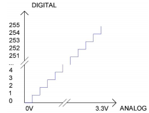

# 第二十课 读取旋转电位器传感器的值

## 1.1 项目介绍

在这个套件中，有一个Keyes 旋转电位器传感器，它一个模拟传感器。前面我们学习过的传感器，都是数字传感器。例如我们前面学习的按键模块，当按键没有按下去时，我们读取到高电平（3.3V），当按键按下去时，我们读取到低电平（0V），而在0~3.3V中间的电压值，我们数字IO口无法读取到，当然按键模块也只能输出高低电平。而模拟传感器就可以通过我们ESP32主板上的16个ADC模拟口读取中间的电压值。

---

## 1.2 模块参数

工作电压 : DC 3.3 ~ 5V 

工作电流 : 20 mA

工作功率 : 0.1 W

工作温度 ：-10°C ~ +50°C

输出信号 : 模拟信号

尺寸 ：32 x 23.8 x 28.4 mm

定位孔大小：直径为 4.8 mm

接口 ：间距为2.54 mm 3pin防反接口

---

## 1.3 模块原理图


旋转电位器原理是靠电刷在电阻体上滑动，在电路中获取与输入电压形成一定关系地输出电压。Keyes 旋转电位器传感器选用了一个10K可调电阻。通过旋转电位器，我们可以改变电阻大小，信号端S检测到电压变化（0 ~ 3.3V），而这个电压变化是一个连续变化的模拟量，也就是在0~3.3V内可以取任意值，我们必须先对这个模拟量进行ADC采集，来测量连续的这些模拟量。A/D 是模拟量到数字量的转换，依靠的是模数转换器(Analog to Digital Converter)，简称ADC。我们的ESP32主板已经集成了ADC采集，可以直接使用。

我们的ESP32主板ADC位数是12位。一个 n 位的 ADC 表示这个 ADC 共有 2 的 n 次方个刻度，12位的 ADC，输出的是从0～4095一共4096个数字量，也就是 2 的 12 次方个数据刻度，每个刻度就是3.3V/4095≈0.00081V，这也叫分辨率。

ADC：ADC是一种电子集成电路，用于将模拟信号(如电压)转换为由1和0表示的数字信号。我们在ESP32上的ADC的范围是12位（ADC的位数表示将模拟量转换成数字量后所用的二进制位数），其可存储数字量范围为：0 ~ 2^12即0 ~ 4096。假设它的参考电压是3.3V，也就是说把参考电压分成4095份，最小分辨率为3.3V/4095，模拟值的范围对应于ADC值。因此，ADC拥有的比特越多，模拟的分区就越密集，最终转换的精度也就越高。



纵坐标数字0 : 0V ~ 3.3/4095V 范围内的模拟量（横坐标）;

纵坐标数字1 : 3.3/ 4095V ~ 2*3.3 /4095V 范围内的模拟量（横坐标）;

......

模拟将被相应地划分。换算公式如下：


DAC：这一过程的可逆需要DAC，数字到模拟转换器。数字I/O端口可以输出高电平和低电平(0或1)，但不能输出中间电压值，这就是DAC有用的地方。ESP32有两个8位精度的DAC输出引脚GPIO25和GPIO26，可以将VCC(这里是3.3V)分成2*8=256个部分。例如，当数字量为1时，输出电压值为3.3/256 * 1V，当数字量为128时，输出电压值为3.3/256 *128=1.65V, DAC的精度越高，输出电压值的精度就越高。

换算公式如下：


ADC on ESP32：

ESP32有16个引脚，可以用来测量模拟信号。GPIO引脚序列号和模拟引脚定义如下表所示：

| **ADC number in ESP32** | **ESP32 GPIO number** |
| ----------------------- | --------------------- |
| ADC0                    | GPIO 36               |
| ADC3                    | GPIO 39               |
| ADC4                    | GPIO 32               |
| ADC5                    | GPIO33                |
| ADC6                    | GPIO34                |
| ADC7                    | GPIO 35               |
| ADC10                   | GPIO 4                |
| ADC11                   | GPIO0                 |
| ADC12                   | GPIO2                 |
| ADC13                   | GPIO15                |
| ADC14                   | GPIO13                |
| ADC15                   | GPIO 12               |
| ADC16                   | GPIO 14               |
| ADC17                   | GPIO27                |
| ADC18                   | GPIO25                |
| ADC19                   | GPIO26                |

DAC on ESP32：

ESP32有两个8位数字模拟转换器，分别连接到GPIO25和GPIO26引脚，它是不可变的。如下表所示：

| **Simulate pin number** | **GPIO number** |
| ----------------------- | --------------- |
| DAC1                    | GPIO25          |
| DAC2                    | GPIO26          |

---

## 1.4 实验组件

|  |   |        |  |
| ------------------------ | ------------------------- | ---------------------------- | --------------------- |
| ESP32 Plus主板 x1        | Keyes 旋转电位器传感器 x1 | XH2.54-3P 转杜邦线母单线  x1 | USB线  x1             |

---

## 1.5 模块接线图


---

## 1.6 在线运行代码

打开Thonny并单击，然后单击“**此电脑**”。

选中“**D:\代码**”路径，打开代码文件''**lesson_20_potentiometer.py**"。

```python
# 导入引脚、ADC和DAC模块
from machine import ADC,Pin,DAC 
import time

# 开启并配置ADC，量程为0-3.3V
adc=ADC(Pin(34))
adc.atten(ADC.ATTN_11DB)
adc.width(ADC.WIDTH_12BIT)

# 每0.1秒读取一次ADC值，将ADC值转换为DAC值输出;
#并将这些数据打印到“Shell”
try:
    while True:
        adcVal=adc.read()
        dacVal=adcVal//16
        voltage = adcVal / 4095.0 * 3.3
        print("ADC Val:",adcVal,"DACVal:",dacVal,"Voltage:",voltage,"V")
        time.sleep(0.1)
except:
    pass
```

---

## 1.7 实验结果

按照接线图正确接好模块，用USB线连接到计算机上电，单击来执行程序代码。代码开始执行，转动电位器手柄时，“Shell”窗口打印出此时电位器的ADC值、DAC值和电压的值。


---

## 1.8 代码说明

| 代码                            | 说明                                                         |
| ------------------------------- | ------------------------------------------------------------ |
| from machine import ADC,Pin,DAC | 使用ACD、DAC模块之前，需要将它们添加到python文件的顶部。     |
| adc=ADC(Pin(34))                | 创建一个与给定pin关联的DAC对象。pin：可用的引脚是Pin(36)、Pin(39)、Pin(34）、Pin(35)、Pin(32)、Pin(33)。 |
| adc.read()                      | 读取ADC值并返回ADC值。                                       |
| adc.atten(ADC.ATTN_11DB)        | 设定衰减比。                                                 |
| DB                              | 衰减比 / 衰减率。                                            |
| ADC.ATTN_11DB                   | 3.3V全量程。                                                 |
| adc.width(ADC.WIDTH_12BIT)      | 设置数据宽度。                                               |
| ADC.WIDTH_12BIT                 | 12数据宽度。                                                 |

 
