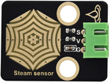

# 第二十课 水滴水蒸气传感器

## 1.1 项目介绍

在这个套件中，有一个Keyes 水滴传感器，它是一个模拟（数字）输入模块，也叫雨水、雨量传感器。可用于各种天气状况的监测，检测是否下雨及雨量的大小，转成数字信号（DO）和模拟信号（AO）输出，并广泛应用于Arduino 机器人套件，雨滴，下雨传感器，可用于各种天气状况的监测，并转成数定信号和 AO 输出，也可用于汽车自动刮水系统、智能灯光系统和智能天窗系统等。

---

## 1.2 模块参数

工作电压 : DC 5V 

电流 : 30 mA

最大功率 : 0.15 W

工作温度 ：-10°C ~ +50°C

控制信号 : 模拟信号

尺寸 ：32 x 23.8 x 9.3 mm

定位孔大小：直径为 4.8 mm

接口 ：间距为2.54 mm 3pin防反接口

---

## 1.3 模块原理图


Keyes 水滴传感器通过电路板上裸露的印刷平行线检测水量的大小。水量越多，就会有更多的导线被联通，随着导电的接触面积增大，雨滴感应区 2 脚输出的电压就会逐步上升。信号端 S 检测到的模拟值就越大。除了可以检测水量的大小，它还可以检测空气中的水蒸气。


---

## 1.4 实验组件

|  |  |        |  |
| ------------------------ | ------------------------ | ---------------------------- | --------------------- |
| ESP32 Plus主板 x1        | Keyes 水滴传感器 x1      | XH2.54-3P 转杜邦线母单线  x1 | USB线  x1             |

---

## 1.5 模块接线图


---

## 1.6 在线运行代码

打开Thonny并单击，然后单击“**此电脑**”。

选中“**D:\代码**”路径，打开代码文件''**lesson_21_Steam_sensor.py**"。

```python
# 导入引脚、ADC和DAC模块
from machine import ADC,Pin,DAC
import time

# 开启并配置ADC，量程为0-3.3V
adc=ADC(Pin(34))
adc.atten(ADC.ATTN_11DB)
adc.width(ADC.WIDTH_12BIT)

# 每0.1秒读取一次ADC值，将ADC值转换为DAC值输出
# 并将这些数据打印到“Shell”
try:
    while True:
        adcVal=adc.read()
        dacVal=adcVal//16
        voltage = adcVal / 4095.0 * 3.3
        print("ADC Val:",adcVal,"DACVal:",dacVal,"Voltage:",voltage,"V")
        time.sleep(0.1)
except:
    pass
```

---

## 1.7 实验结果

按照接线图正确接好模块，用USB线连接到计算机上电，单击来执行程序代码。


在水滴传感器的感应区滴几滴水（**小心用水，注意不要滴到感应区以外的其他任何地方，包括ESP32主板**），“Shell”窗口打印出此时水滴传感器的ADC值、DAC值和电压的值。水量变化，ADC值、DAC值和电压值也会发生变化。水量越多，输出的ADC值，DAC值和电压值越大。


---

## 1.8 代码说明

1. 使用ACD模块之前，导入 “from machine import ADC” 添加到python文件的顶部；每次使用DAC模块之前，请将 “from machine import DAC” 添加到python文件的顶部
2. machine.ADC(pin):创建一个与给定pin相关联的ADC对象。pin：可用的引脚是 Pin(36)、Pin(39)、Pin(34）、Pin(35)、Pin(32)、Pin(33)。
3. DAC(pin):创建一个与给定pin关联的DAC对象。 Pin：可用的引脚是pin (25) 、pin (26)
4. ADC. Read():读取ADC值并返回ADC值。
5. ADC.atten(db): Set attenuation ration (that is, the full range voltage, such as the voltage of 11db full range is 3.3V) 
   db：attenuation ratio 
   ADC.ATTIN_0DB —full range of 1.2V 
   ADC.ATTN_2_5_DB —full range of 1.5V 
   ADC.ATTN_6DB —full range of 2.0 V 
   ADC.ATTN_11DB —full range of 3.3V 
   ADC.width(bit): Set data width. 
   bit： data bit 
   ADC.WIDTH_9BIT —9 data width 
   ADC.WIDTH_10BIT — 10 data width 
   ADC.WIDTH_11BIT — 11 data width 
   ADC.WIDTH_12BIT — 12 data width 
6. read()这个方法为读取ADC值，范围为0~4095，那么adc.read()即读取ADC(Pin(36))引脚输入的ADC值，然后赋给名为adcVal的变量。
7. DAC.write(value):输出电压值，数据值范围:0-255，对应输出电压0-3.3V。

​	

