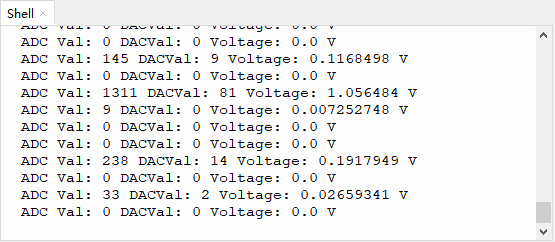

# 第二十二课 声音传感器检测声量

## 1.1 项目介绍

在这个套件中，有一个Keyes 声音传感器。实验中，我们利用这个传感器测试当前环境中的声音对应的ADC值、DAC值和输出的电压值。声音越大，ADC值、DAC值和电压值越大；并在“Shell”窗口上显示测试结果。

---

## 1.2 模块参数

工作电压 : DC 3.3 ~ 5V 

工作电流 : 100 mA

最大功率 : 0.5 W

工作温度 ：-10°C ~ +50°C

输出信号 : 模拟信号

尺寸 ：32 x 23.8 x 10.3 mm

定位孔大小：直径为 4.8 mm

接口 ：间距为2.54 mm 3pin防反接口

---

## 1.3 模块原理图


Keyes 声音传感器主要由一个高感度麦克风元件和LM386音频功率放大器芯片组成。高感度麦克风元件用于检测外界的声音。利用LM386音频功率放大器芯片设计对高感度麦克风检测到的声音进行放大的电路，最大倍数为200倍。使用时我们可以通过旋转传感器上电位器，调节声音的放大倍数。顺时针调节电位器到尽头，放大倍数最大。

---

## 1.4 实验组件

|  |  |        |  |
| ------------------------ | ------------------------ | ---------------------------- | --------------------- |
| ESP32 Plus主板 x1        | Keyes 声音传感器 x1      | XH2.54-3P 转杜邦线母单线  x1 | USB线  x1             |

---

## 1.5 模块接线图


---

## 1.6 在线运行代码

打开Thonny并单击，然后单击“**此电脑**”。

选中“**D:\代码**”路径，打开代码文件''**lesson_22_MicroPhone.py**"。

```python
#导入引脚、ADC和DAC模块
from machine import ADC,Pin,DAC
import time

# 开启并配置ADC，量程为0-3.3V
adc=ADC(Pin(34)) 
adc.atten(ADC.ATTN_11DB)
adc.width(ADC.WIDTH_12BIT)

# 每0.1秒读取一次ADC值，将ADC值转换为DAC值输出
# 并将这些数据打印到“Shell”
try:
    while True:
        adcVal=adc.read()
        dacVal=adcVal//16
        voltage = adcVal / 4095.0 * 3.3
        print("ADC Val:",adcVal,"DACVal:",dacVal,"Voltage:",voltage,"V")
        time.sleep(0.1)
except:
    pass
```

---

## 1.7 实验结果

按照接线图正确接好模块，用USB线连接到计算机上电，单击来执行程序代码。

代码开始执行，“Shell”窗口打印出声音传感器接收到的声音对应的ADC值、DAC值和电压值。对准MIC头大声说话，可以看到接收到的声音对应的ADC值、DAC值和电压值变大。



---

## 1.8 代码说明

此课程代码与第十九课代码类似，这里就不多做介绍了。 
