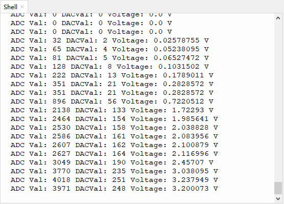

# 第二十三课 光敏电阻传感器

## 1.1 项目介绍

在这个套件中，有一个Keyes 光敏电阻传感器，这是一个常用的光敏电阻传感器，它主要由一个光敏电阻元件组成。光敏电阻元件的阻值随着光照强度的变化而变化，此传感器就是利用光敏电阻元件这一特性，设计电路将阻值变化转换为电压变化。光敏电阻传感器可以模拟人对环境光线的强度的判断，方便做出与人友好互动的应用。

---

## 1.2 模块参数

工作电压 : DC 3.3 ~ 5V 

电流 : 20 mA

最大功率 : 0.1 W

工作温度 ：-10°C ~ +50°C

输出信号 : 模拟信号

尺寸 ：32 x 23.8 x 7.4 mm

定位孔大小：直径为 4.8 mm

接口 ：间距为2.54 mm 3pin防反接口

---

## 1.3 模块原理图


当没有光照射时，电阻大小为0.2 MΩ，光敏电阻的信号端（2脚）检测的电压接近0。随着光照强度增大，光线传感器的电阻值越来越小，所以信号端能检测到的电压越来越大。

---

## 1.4 实验组件

|  |  |        |  |
| ------------------------ | ------------------------ | ---------------------------- | --------------------- |
| ESP32 Plus主板 x1        | Keyes 光敏电阻传感器 x1  | XH2.54-3P 转杜邦线母单线  x1 | USB线  x1             |

---

## 1.5 模块接线图


---

## 1.6 在线运行代码

打开Thonny并单击，然后单击“**此电脑**”。

选中“**D:\代码**”路径，打开代码文件''**lesson_23_photoresistance.py**"。

```python
# 导入引脚、ADC和DAC模块
from machine import ADC,Pin,DAC
import time

# 开启并配置ADC，量程为0-3.3V
adc=ADC(Pin(34)) 
adc.atten(ADC.ATTN_11DB)
adc.width(ADC.WIDTH_12BIT)

# 每0.1秒读取一次ADC值，将ADC值转换为DAC值输出
# 并将这些数据打印到“Shell”
try:
    while True:
        adcVal=adc.read()
        dacVal=adcVal//16
        voltage = adcVal / 4095.0 * 3.3
        print("ADC Val:",adcVal,"DACVal:",dacVal,"Voltage:",voltage,"V")
        time.sleep(0.1)
except:
    pass
```

---

## 1.7 实验结果

按照接线图正确接好模块，用USB线连接到计算机上电，单击来执行程序代码。代码开始执行，“Shell”窗口打印出光敏传感器的ADC值、DAC值和电压值。光照越强，可以看到ADC值，DAC值和电压值越大。



---

## 1.8 代码说明

此课程代码与第十九课代码类似，这里就不多做介绍了。  
