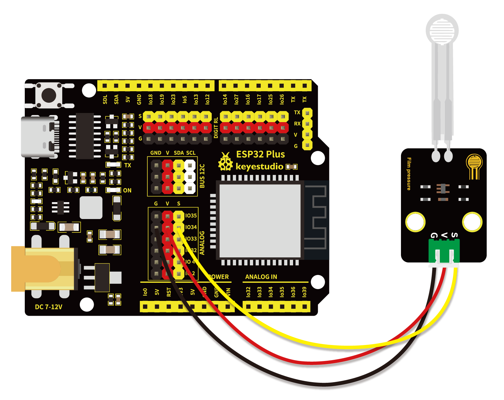
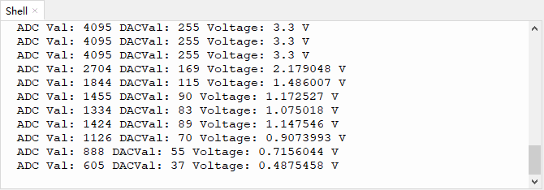

# 第二十五课 薄膜压力传感器

## 1.1 项目介绍

在这个套件中，有一个Keyes 薄膜压力传感器，薄膜压力传感器是基于新型纳米压敏材料辅以舒适杨式模量的超薄薄膜衬底一次性贴片而成，兼具防水和压敏双重功能。

通过采集模块上S端模拟信号，判断压力大小。ADC值、DAC值和电压值越小，压力越大；并在“Shell”窗口上显示测试结果。

---

## 1.2 模块参数

工作电压 : DC 3.3 ~ 5V

电流 : 20 mA

最大功率 : 0.1W

量程 : 0-5KG

响应点 : 150g

重复性 : ＜±9.7%（60%负载）

一致性 : ±10%

耐久性 : ＞100万次

初始电阻 : 大于10MΩ(无负载)

响应时间 : ＜1ms

恢复时间 : ＜15ms

工作温度 ：-10°C ~ +50°C

输出信号 : 模拟信号

尺寸 ：32 x 23.8 x 7.4 mm

定位孔大小：直径为 4.8 mm

接口 ：间距为2.54 mm 3pin防反接口

---

## 1.3 模块原理图


当传感器感知到外界压力时，传感器的电阻值发生变化。Keyes 薄膜压力传感器使用LM321运算放大器芯片将传感器感知到的压力变化的压力信号转换成相应变化强度的电信号输出。这样就可以通过检测电压信号变化得知压力变化情况。

---

## 1.4 实验组件

|  |  |        |  |
| ------------------------ | ------------------------ | ---------------------------- | --------------------- |
| ESP32 Plus主板 x1        | Keyes 薄膜压力传感器 x1  | XH2.54-3P 转杜邦线母单线  x1 | USB线  x1             |

---

## 1.5 模块接线图



---

## 1.6 在线运行代码

打开Thonny并单击，然后单击“**此电脑**”。

选中“**D:\代码**”路径，打开代码文件''**lesson_25_film pressure.py**"。

```python
#导入引脚、ADC和DAC模块
from machine import ADC,Pin,DAC
import time

#开启并配置ADC，量程为0-3.3V
adc=ADC(Pin(34)) 
adc.atten(ADC.ATTN_11DB)
adc.width(ADC.WIDTH_12BIT)

# 每0.1秒读取一次ADC值，将ADC值转换为DAC值输出
# 并将这些数据打印到“Shell”
try:
    while True:
        adcVal=adc.read()
        dacVal=adcVal//16
        voltage = adcVal / 4095.0 * 3.3
        print("ADC Val:",adcVal,"DACVal:",dacVal,"Voltage:",voltage,"V")
        time.sleep(0.1)
except:
    pass
```

---

## 1.7 实验结果

为了使实验数据最精准，请将薄膜压力传感器尽量平放。按照接线图正确接好模块，用USB线连接到计算机上电，单击来执行程序代码。

代码开始执行，"Shell"窗口打印出薄膜压力传感器的ADC值、DAC值和电压值。用手按压薄膜时，随着力量的增大，可以看到ADC值，DAC值和电压值逐渐变小。



---

## 1.8 代码说明

 此课程代码与第十九课代码类似，这里就不多做介绍了。  

