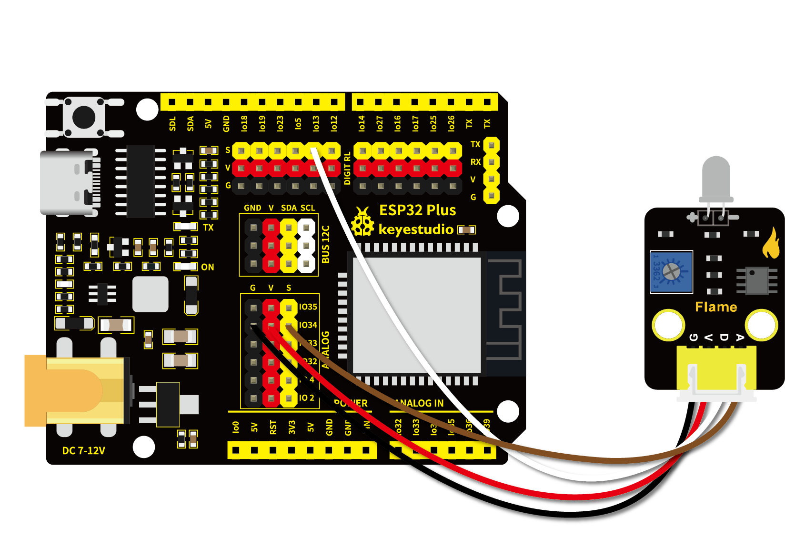

# 第二十六课 火焰传感器

## 1.1 项目介绍

在这个套件中，有一个Keyes 火焰传感器，它对火焰光谱特别灵敏，且灵敏度可调。性能稳定，是救火机器人的必备部件。火焰传感器上有一个远红外火焰探头，起着非常重要的作用，它可以用作机器人的眼睛来寻找火源或足球。利用它可以制作灭火机器人、足球机器人等。

该传感器有两个信号输出端，分别可输出数字信号与模拟信号。实验中，我们分别读取模块传感器数字信号与模拟信号，将测试结果在"Shell"窗口上显示。

---

## 1.2 模块参数

工作电压 : DC 3.3 ~ 5V

电流 : 100 mA

最大功率 : 0.5 W

输出信号 ：模拟信号和数字信号

工作温度 ：-10°C ~ +50°C

尺寸 ：32 x 23.8 x 9.2 mm

定位孔大小：直径为 4.8 mm

接口 ：间距为2.54 mm 4pin防反接口

---

## 1.3 模块原理图

红外火焰传感器能够探测到波长在700纳米～1000纳米范围内的红外光，探测角度为60，其中红外光波长在880纳米附近时，其灵敏度达到最大。从电路原理图我们可以看到，上电后红色LED2先点亮，红色LED1处于熄灭状态，检测到火焰时，数字信号端D0输出低电平，红色LED1将点亮。红外火焰探头将外界红外光的强弱变化转化为电流的变化，通过A/D转换器反映为0～255范围内数值的变化。外界红外光越强，数值越小；红外光越弱，数值越大。


---

## 1.4 实验组件

|  |  |        |  |
| ------------------------ | ------------------------ | ---------------------------- | --------------------- |
| ESP32 Plus主板 x1        | Keyes 火焰传感器 x1      | XH2.54-4P 转杜邦线母单线  x1 | USB线  x1             |

---

## 1.5 模块接线图



---

## 1.6 在线运行代码

打开Thonny并单击，然后单击“**此电脑**”。

选中“**D:\代码**”路径，打开代码文件''**lesson_26_Flame_sensor.py**"。

```python
# 导入引脚、ADC和DAC模块
from machine import ADC,Pin,DAC
import time

flame_D = Pin(13, Pin.IN)
# 开启并配置ADC，量程为0-3.3V
adc=ADC(Pin(34))
adc.atten(ADC.ATTN_11DB)
adc.width(ADC.WIDTH_12BIT)

# 每0.1秒读取一次数字值和ADC值，将ADC值转换为DAC值和电压值输出
# 并将这些数据打印到“Shell”
try:
    while True:
        digitalVal = flame_D.value() 
        adcVal=adc.read()
        dacVal=adcVal//16
        voltage = adcVal / 4095.0 * 3.3
        print("digitalVal:",digitalVal,"ADC Val:",adcVal,"DACVal:",dacVal,"Voltage:",voltage,"V")
        time.sleep(0.1)
except:
    pass
```

---

## 1.7 实验结果

按照接线图正确接好模块，用USB线连接到计算机上电，单击来执行程序代码。

此时火焰传感器上的红色LED2点亮。旋转火焰传感器上的电位器，微调使传感器上红色LED1灯介于亮与不亮之间的**不亮**状态。


"Shell"窗口打印出火焰传感器的digital值，ADC值，DAC值和电压值。当传感器检测到火焰时，红色LED1点亮，在"Shell"窗口中可以看到数字值由1变为0，ADC值，DAC值和电压值变小。


---

## 1.8 代码说明

 此课程代码与第十九课代码类似，这里就不多做介绍了。   
