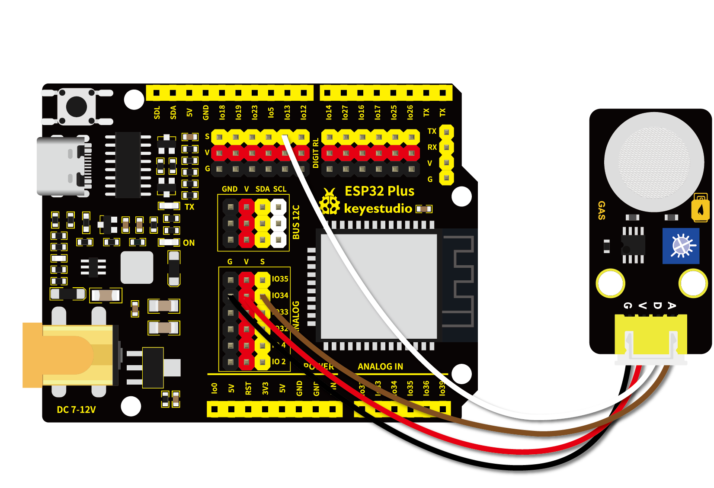
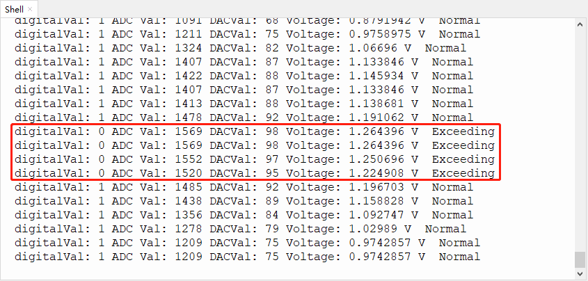

# 第二十七课 MQ-2 烟雾传感器

## 1.1 项目介绍

在这个套件中，有一个Keyes MQ-2模拟气体传感器，它主要用到了MQ-2 可燃气体、烟雾传感器元件。该元件所使用的气敏材料是在清新空气中电导率较低的二氧化锡(SnO2)。当传感器所处环境中存在可燃气体时，传感器的电导率随空气中可燃气体浓度的增加而增大。该传感器对液化气、丙烷、氢气的灵敏度高，对天然气和其它可燃蒸汽的检测也很理想。它可检测多种可燃性气体，是一款适合多种应用的低成本传感器。

实验中，我们读取传感器 A 端模拟值，和 D 端数字值，判断空气中气体的含量，以及它们是否超标。

---

## 1.2 模块参数

工作电压 : DC 3.3 ~ 5V

电流 : 100 mA

最大功率 : 0.5 W

输出信号 ：模拟信号和数字信号

工作温度 ：-10°C ~ +50°C

尺寸 ：47.6 x 23.8 x 17.9 mm

定位孔大小：直径为 4.8 mm

接口 ：间距为2.54 mm 4pin防反接口

---

## 1.3 模块原理图

当Keyes MQ-2模拟气体传感器与烟雾接触时，晶粒间界处的势垒受到烟雾的浓度变化而变化，就会引起表面导电率的变化。利用这一点就可以获得这种烟雾存在的信息，烟雾的浓度越大，导电率越大，输出电阻越低，则输出的模拟信号就越大。

使用时，A 端读取对应气体的模拟值；D 端连接一个LM393芯片（电压比较器），我们可以通过电位器调节测量气体报警临界点，在 D 端输出数字值。当测量气体含量超过临界点时，D 端输出低电平；测量气体含量没超过临界点时，D 端输出高电平。


---

## 1.4 实验组件

|  |     |        |  |
| ------------------------ | --------------------------- | ---------------------------- | --------------------- |
| ESP32 Plus主板 x1        | Keyes MQ-2模拟气体传感器 x1 | XH2.54-4P 转杜邦线母单线  x1 | USB线  x1             |

---

## 1.5 模块接线图



---

## 1.6 在线运行代码

打开Thonny并单击，然后单击“**此电脑**”。

选中“**D:\代码**”路径，打开代码文件''**lesson_27_MQ-2.py**"。

```python
#导入引脚、ADC和DAC模块
from machine import ADC,Pin,DAC
import time

mq2_D = Pin(13, Pin.IN)
# 开启并配置ADC，量程为0-3.3V
adc=ADC(Pin(34)) 
adc.atten(ADC.ATTN_11DB)
adc.width(ADC.WIDTH_12BIT)

# 每0.1秒读取一次数字值和ADC值，将ADC值转换为DAC值和电压值输出
# 并将这些数据打印到“Shell”

while True:
    digitalVal = mq2_D.value()
    adcVal=adc.read()
    dacVal=adcVal//16
    voltage = adcVal / 4095.0 * 3.3
    print("digitalVal:",digitalVal,"ADC Val:",adcVal,"DACVal:",dacVal,"Voltage:",voltage,"V", end = "  ")
    if digitalVal == 0:
        print("Exceeding")
    else:
        print("Normal")
    time.sleep(0.1)
```

---

## 1.7 实验结果

按照接线图正确接好模块，用USB线连接到计算机上电，单击来执行程序代码。

代码开始执行，旋转MQ-2模拟气体传感器上的电位器，微调使传感器上红色LED灯介于亮与不亮之间的**不亮**状态。

"Shell"窗口打印出对应的数据和字符，当传感器检测到烟雾或可燃性气体时，红色LED点亮，在"Shell"窗口中可以看到数字值由1变为0，ADC值，DAC值和电压值变大。



---

## 1.8 代码说明

 此课程代码与第十九课代码类似，这里就不多做介绍了。   
