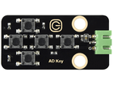

# 第二十九课 五路AD按键

## 1.1 项目介绍

第七课我们学习了单路按键模块，当按下按键时输出低电平，松开按键时输出高电平，只能读取到这两个数字信号。在这个套件中，有一个Keyes 五路AD按键模块，与单路按键模块原理不同，五路AD按键模块只占用一个模拟量端口，节省资源。模拟量采集，按下不同的按键输出不同的电压。

---

## 1.2 模块参数

工作电压 : DC 3.3 ~ 5V

电流 : 20 mA

最大功率 : 0.1 W

数据类型 : 模拟信号

工作温度 ：-10°C ~ +50°C

尺寸 ：47.6 x 23.8 x 9.3 mm

定位孔大小：直径为 4.8 mm

接口 ：间距为2.54 mm 3pin防反接口

---

## 1.3 模块原理图


当没有按下按键时，输出到信号端S的OUT被R1拉低，此时我们读取到的是低电平0V；

当按下按键SW1时，输出到信号端S的OUT相当于直接连接到了VCC，此时我们读取到的是高电平3.3V；

当按下按键SW2时，我们读取到的信号OUT端电压就是R2与R1之间的电压，即VCC*R1/(R2+R1)，约为2.63V，模拟值约为3244；

当按下按键SW3时，我们读取到的信号OUT端电压就是R2+R3与R1之间的电压，即VCC*R1/(R3+R2+R1)，约为1.98V，模拟值约为2386；

当按下按键SW4时，我们读取到的信号OUT端电压就是R2+R3+R4与R1之间的电压，即VCC*R1/(R4+R3+R2+R1)，约为1.31V，模拟值约为1530；

当按下按键SW5时，我们读取到的信号OUT端电压就是R2+R3+R4+R5与R1之间的电压，即VCC*R1/(R5+R4+R3+R2+R1)，约为0.68V，模拟值约为707。

---

## 1.4 实验组件

|  |  |        |  |
| ------------------------ | ------------------------ | ---------------------------- | --------------------- |
| ESP32 Plus主板 x1        | Keyes 五路AD按键模块 x1  | XH2.54-3P 转杜邦线母单线  x1 | USB线  x1             |

---

## 1.5 模块接线图


---

## 1.6 在线运行代码

打开Thonny并单击，然后单击“**此电脑**”。

选中“**D:\代码**”路径，打开代码文件''**lesson_29_Five_AD_keys.py**"。

```python
# 导入引脚和ADC模块
from machine import ADC,Pin
import time 

# 开启并配置ADC，量程为0-3.3V
adc=ADC(Pin(34))
adc.atten(ADC.ATTN_11DB)
adc.width(ADC.WIDTH_12BIT)

while True:
    adcvalue = adc.read() 
    print(adcvalue, end = '')
    if adcvalue <= 500:
        print("  no key  is pressed")
    elif adcvalue <= 1000:
        print("  SW5 is pressed")
    elif adcvalue <= 2000:
        print("  SW4 is pressed")
    elif adcvalue <= 3000:
        print("  SW3 is pressed")
    elif adcvalue <= 4000:
        print("  SW2 is pressed")
    else:
        print("  SW1 is pressed")
    time.sleep(0.1)
```

---

## 1.7 实验结果

按照接线图正确接好模块，用USB线连接到计算机上电，单击来执行程序代码。代码开始执行，当按下按键时，“Shell”窗口打印出对应的信息。


---

## 1.8 代码说明

将读取到的模拟值赋给变量val，“Shell”窗口打印出val的值。

对读取到的模拟值进行判断，当模拟值低于500时，判断按键没有被按下；当模拟值处于500 ~ 1000之间时，判断按键SW5被按下；当模拟值处于1000 ~ 2000之间时，判断按键SW4被按下；当模拟值处于2000 ~ 3000之间时，判断按键SW3被按下；当模拟值处于3000 ~ 4000之间时，判断按键SW2被按下；当模拟值大于4000时，判断按键SW1被按下。
