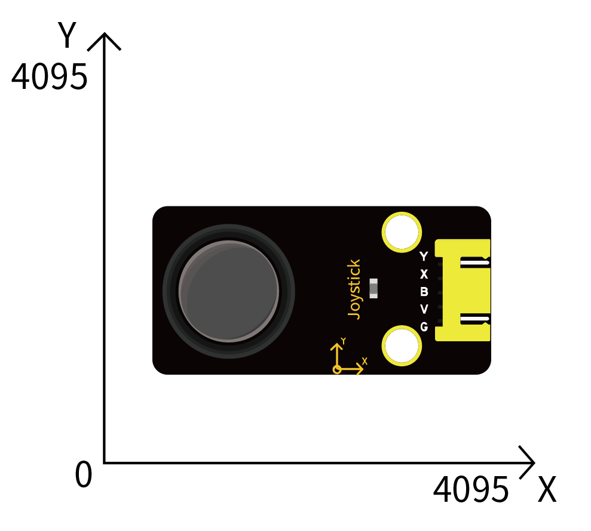

# 第三十课 摇杆模块

## 1.1 项目介绍

你看过游戏手柄吗？游戏手柄上有按键，还有摇杆。摇杆是什么工作原理呢？在我们这个套件中，就有一个Keyes 摇杆模块，它的主要元件是PS2手柄摇杆。控制时，我们需要将模块的X端口和Y端口连接至单片机的模拟口。B端口连接至单片机数字口，V端口接至单片机电源输出端（3.3-5V），GND接单片机GND。通过读取两个模拟值和一个数字口的高低电平情况，可以判断模块上摇杆的工作状态。

---

## 1.2 模块参数

工作电压 : DC 3.3 ~ 5V 

电流 : 50 mA

最大功率 : 0.25 W

输出信号 : 信号端X、Y 模拟电压输出

信号端B  : 数字电平输出 

工作温度 ：-10°C ~ +50°C

控制信号 : 数字信号

尺寸 ：47.6 x 23.8 x 34.5 mm

定位孔大小：直径为 4.8 mm

接口 ：间距为2.54 mm 5pin防反接口

---

## 1.3 模块原理图


其实它的原理非常简单，内部相当于两个可调电位器（左右和上下）和一个按键。按键没有按下时被R1下拉为低电平，按下时接通VCC即为高电平，与我们前面学习过的按键模块的电平值是相反的。摇动摇杆时内部的电位器就会根据摇杆的摇动调节，从而输出不同的电压，可以读取到模拟值。

---

## 1.4 实验组件

|  |  |        |  |
| ------------------------ | ------------------------ | ---------------------------- | --------------------- |
| ESP32 Plus主板 x1        | Keyes 摇杆模块 x1        | XH2.54-5P 转杜邦线母单线  x1 | USB线  x1             |

---

## 1.5 模块接线图


---

## 1.6 在线运行代码

打开Thonny并单击，然后单击“**此电脑**”。

选中“**D:\代码**”路径，打开代码文件''**lesson_30_joystick.py**"。

```python
from machine import Pin, ADC
import time
#初始化摇杆模块(ADC功能)
rocker_x=ADC(Pin(34)) 
rocker_y=ADC(Pin(35))
button_z=Pin(13,Pin.IN,Pin.PULL_UP)

# 设置两个ADC通道的电压采集范围为0-3.3V，
# 并且采集的数据宽度为0-4095
rocker_x.atten(ADC.ATTN_11DB)
rocker_y.atten(ADC.ATTN_11DB)
rocker_x.width(ADC.WIDTH_12BIT)
rocker_y.width(ADC.WIDTH_12BIT)
 
# 在代码中，将Z_Pin配置为上拉输入模式
# 在loop()中，使用Read()读取X轴和Y轴的值
# 并使用value()读取Z轴的值，然后显示它们
while True:
    print("X,Y,Z:",rocker_x.read(),",",rocker_y.read(),",",button_z.value())
    time.sleep(0.5)
```

---

## 1.7 实验结果

按照接线图正确接好模块，用USB线连接到计算机上电，单击来执行程序代码。代码开始执行，“Shell”窗口将打印出当前摇杆X轴和Y轴对应的模拟值以及Z轴对应的数字值，移动摇杆或按下它将改变“Shell”窗口中的模拟值和数字值。当按下摇杆时，Z值为1；未按下摇杆时，Z值为0。X值从左到右由0增长到4095。Y值从下到上由0增长到4095。



在X轴上移动摇杆，使数据从小到大。


在Y轴上移动摇杆，使数据从小到大。


按下摇杆。


---

## 1.8 代码说明

| 代码                                | 说明                       |
| ----------------------------------- | -------------------------- |
| button_z=Pin(13,Pin.IN,Pin.PULL_UP) | 将引脚设置为输入上拉模式。 |

 
