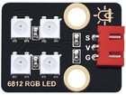
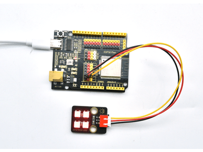
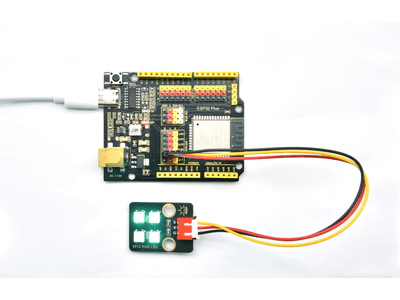

# 第三十二课 SK6812 RGB

## 1.1 项目介绍

前面学习了插件RGB模块，利用PWM信号对模块的三个引脚进行调色。我们这个套件中，还有一个Keyes 6812 RGB模块。SK6812 RGB 模块驱动原理与插件RGB模块的驱动原理不相同，只需要一个引脚控制。这是一个集控制电路与发光电路于一体的智能外控LED光源。每个LED原件其外型与一个5050LED灯珠相同，每个元件即为一个像素点，我们这个模块上有四个灯珠即四个像素点。

---

## 1.2 模块参数

工作电压 : DC 3.3 ~ 5V 

最大功率 : 1W

光源 : SMD 5050 RGB

IC型号 : 4颗/WS2811

灰度等级 : 256级

发光角度 : 180°

发光颜色 : 可以通过控制器调为白，红，黄，蓝，绿,等

工作温度 ：-10°C ~ +50°C

尺寸 ：32 x 23.8 x 7.4 mm

定位孔大小：直径为 4.8 mm

接口 ：间距为2.54 mm 3pin防反接口

---

## 1.3 模块原理图


从原理图中我们可以看出，这四个像素点灯珠串联。其实不论多少个灯珠串联，我们都可以用一个引脚控制其中任意一个灯让它显示任意一种颜色。像素点内部包含了智能数字接口数据锁存信号整形放大驱动电路，还包含有高精度的内部振荡器和12V高压可编程定电流控制部分，有效保证了像素点光的颜色高度一致。

数据协议采用单线归零码的通讯方式，像素点在上电复位以后，S端接受从控制器传输过来的数据，首先送过来的24bit数据被第一个像素点提取后，送到像素点内部的数据锁存器。这个6812RGB通讯协议与驱动已经在底层封装好了，我们直接调用函数的接口就可以使用。

---

## 1.4 实验组件

|  |  |        |  |
| ------------------------ | ------------------------ | ---------------------------- | --------------------- |
| ESP32 Plus主板 x1        | Keyes 6812 RGB模块 x1    | XH2.54-3P 转杜邦线母单线  x1 | USB线  x1             |

---

## 1.5 模块接线图


---

## 1.6 在线运行代码

打开Thonny并单击，然后单击“**此电脑**”。

选中“**D:\代码**”路径，打开代码文件''**lesson_32_Sk6812_RGB.py**"。

```python
#导入Pin, neopiexl和time模块
from machine import Pin
import neopixel
import time

#定义连接到新像素的引脚和led的数量
pin = Pin(4, Pin.OUT)
np = neopixel.NeoPixel(pin, 4) 

#亮度:0 - 255
brightness=100                                
colors=[[brightness,0,0],                    #红
        [0,brightness,0],                    #绿
        [0,0,brightness],                    #蓝
        [brightness,brightness,brightness],  #白
        [0,0,0]]                             #关闭

#嵌套两个for循环，使模块反复显示红、绿、蓝、白、OFF五种状态    
while True:
    for i in range(0,5):
        for j in range(0,4):
            np[j]=colors[i]
            np.write()
            time.sleep_ms(50)
        time.sleep_ms(500)
    time.sleep_ms(500)
```

---

## 1.7 实验结果

按照接线图正确接好模块，用USB线连接到计算机上电，单击来执行程序代码。代码开始执行，可以看到模块上的4个RGB LED一个接一个地填充红色、绿色、蓝色、白色。





---

## 1.8 代码说明

| 代码                           | 说明                                           |
| ------------------------------ | ---------------------------------------------- |
| pin = Pin(4, Pin.OUT)          | 定义引脚号。                                   |
| np = neopixel.NeoPixel(pin, 4) | 灯珠的数量，板子上灯珠为4颗，所以这里设置为4。 |
| brightness=100                 | 亮度设置，255最亮。                            |

 
