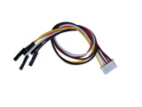
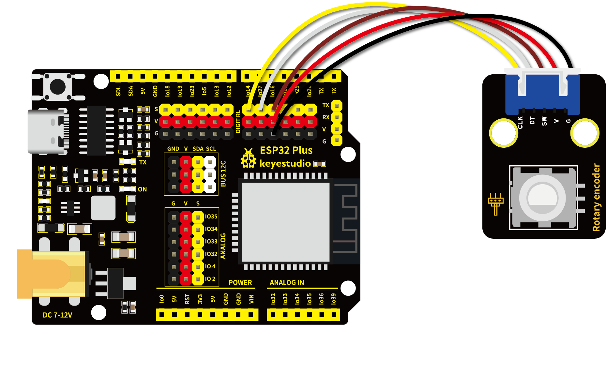

# 第三十三课 旋转编码器模块计数

## 1.1 项目介绍

在这个套件中，有一个Keyes 旋转编码器模块，也叫开关编码器、旋转编码器。此款编码器有20脉冲20定位点、15脉冲30定位点两种。编码器主要用于汽车电子、多媒体音响、仪器仪表、家用电器、智能家居、计算机周边、医疗器械等领域。主要用于频率调节、亮度调节、温度调节、音量调节的参数控制等。

---

## 1.2 模块参数

工作电压 : DC 5V 

电流 : 20 mA

最大功率 : 0.1 W

工作温度 ：-10°C ~ +50°C

控制信号 : 数字信号

尺寸 ：32 x 23.8 x 30.6 mm

定位孔大小：直径为 4.8 mm

接口 ：间距为2.54 mm 5pin防反接口

---

## 1.3 模块原理图


增量式编码器是将位移转换成周期性的电信号，再把这个电信号转变成计数脉冲，用脉冲的个数表明位移的巨细。Keyes 旋转编码器模块采用的是20脉冲旋转编码器元件，它可以通过旋转计数正方向和反方向转动过程中输出脉冲的次数，这种转动计数是没有限制的，复位到初始状态，即从0开始计数。

旋转编码器提供两种交互方式：
- **按钮**   单击旋钮以按下按钮。按下时，按钮将 SW 引脚与 GND 引脚连接，也就是SW引脚的电平为低电平。

- **旋转**   每次旋转旋钮时，会在 DT 和 CLK 引脚上产生一个 LOW 信号。
  

    - 顺时针旋转会导致 CLK 引脚首先变低，然后 DT 引脚也变低。
    
    - 逆时针旋转会导致 DT 引脚先变低，然后 CLK 引脚变低。
    
    两个引脚将在几毫秒内返回高电平。如下图所示：
    
    


---

## 1.4 实验组件

|  |  |        |  |
| ------------------------ | ------------------------ | ---------------------------- | --------------------- |
| ESP32 Plus主板 x1        | Keyes 旋转编码器模块 x1  | XH2.54-5P 转杜邦线母单线  x1 | USB线  x1             |

---

## 1.5 模块接线图



---

## 1.6 在线运行代码

上传代码前先添加库。打开Thonny，在文件管理框单击“**此电脑**”，双击“**（D:）**”，然后双击展开“**代码**”文件夹。展开“**33 Rotary encoder counting**”文件夹，右键单击“**rotary.py**”，选择“**上传到/**”，等待被上传到ESP32。然后继续右键单击“**rotary_irq_rp2.py**”，选择“**上传到/**”，等待被上传到ESP32。

上传完成后双击打开代码文件“**lesson_33_Rotary_encoder_counting.py**”。

```python
import time
from rotary_irq_rp2 import RotaryIRQ
from machine import Pin

SW=Pin(16,Pin.IN,Pin.PULL_UP)  
r = RotaryIRQ(pin_num_clk=14,
              pin_num_dt=27,
              min_val=0,
              reverse=False,
              range_mode=RotaryIRQ.RANGE_UNBOUNDED)
val_old = r.value()
while True:
    try:
        val_new = r.value()
        if SW.value()==0 and n==0:
            print("Button Pressed")
            print("Selected Number is : ",val_new)
            n=1
            while SW.value()==0:
                continue
        n=0
        if val_old != val_new:
            val_old = val_new
            print('result =', val_new)
        time.sleep_ms(50)
    except KeyboardInterrupt:
        break
```

---

## 1.7 实验结果

按照接线图正确接好模块，用USB线连接到计算机上电，单击来执行程序代码。代码开始执行，顺时针旋转编码器，“Shell”窗口打印出来的数据**<u>减小</u>**；逆时针旋转编码器，“Shell”窗口打印出来的数据**<u>增大</u>**；按下编码器中间按键，“Shell”窗口打印“**<u>Button Pressed</u>**    **<u>Selected Number is :（当前值)</u>**”。


---

## 1.8 代码说明

| 代码             | 说明                                                         |
| ---------------- | ------------------------------------------------------------ |
| try:...except... | python语言异常捕捉处理语句，try执行代码，except发生异常时执行的代码。 |
| r.value()        | 返回编码器的值。                                             |

 
