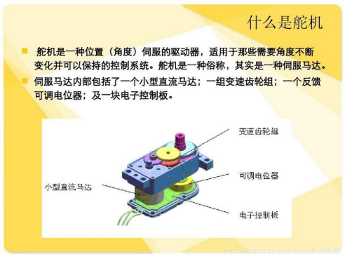
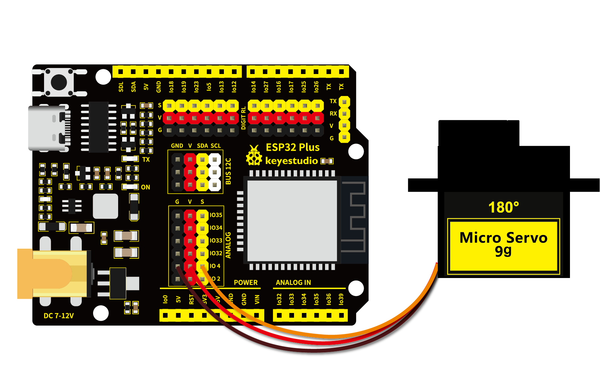

# 第三十四课 舵机的控制原理

## 1.1 项目介绍



舵机是一种位置伺服的驱动器，主要是由外壳、电路板、无核心马达、齿轮与位置检测器所构成。舵机有很多规格，但所有的舵机都有外接三根线。由于舵机品牌不同，颜色也会有所差异，我们实验用到的这款舵机分别用棕、红、橙三种颜色进行区分，棕色为接地线，红色为电源正极，橙色为信号线。


舵机分为360度舵机、180度舵机和90度舵机，我们实验用到的这款舵机为90度舵机，但是它转动的角度范围最大接近180度，所以我们也可把它当做180度舵机使用，控制原理都是一样的。


---

## 1.2 模块参数

工作电压 : DC 3.3 ~ 5V 

工作温度 ：-10°C ~ +50°C

尺寸 ：32.25 x 12.25 x 30.42 mm

接口 ：间距为2.54 mm 3pin接口

---

## 1.3 模块原理图


舵机的控制信号是周期为20ms （50Hz）的PWM（脉冲宽度调制）信号。

舵机的转动的角度是通过调节PWM信号的占空比来实现的，一般在 0.5ms ~ 2.5ms 的范围内去控制，总间隔为 2ms，相对应舵盘的位置为0度 ~ 180度，呈线性变化。当脉冲宽度为 1.5ms 时，舵机旋转至中间角度，大于 1.5ms 时舵机旋转角度增大，小于 1.5ms 时舵机旋转角度减小。

也就是说，舵机的控制需要单片机产生一个周期为20ms的脉冲信号，以0.5ms到2.5ms的高电平来控制舵机转动的角度。具体脉冲参数下图所示：


注意，由于舵机品牌不同，对于同一信号，不同品牌的舵机旋转的角度也会有所不同。

---

## 1.4 在线运行组件

|  |  |  |
| ------------------------ | -------------------- | --------------------- |
| ESP32 Plus主板 x1        | 9G 180度数字舵机 x1  | USB线  x1             |

---

## 1.5 实验

### 1.5.1 实验①：

#### （1）实验接线图



#### （2）在线运行代码

打开Thonny并单击，然后单击“**此电脑**”。

选中“**D:\代码**”路径，打开代码文件''**lesson_34_Servo_test1.py**"。

```python
from machine import Pin, PWM
import time
pwm = PWM(Pin(4))  
pwm.freq(50)

'''
Duty cycle corresponding to the Angle
0°----2.5%----25
45°----5%----51.2
90°----7.5%----77
135°----10%----102.4
180°----12.5%----128
'''
angle_0 = 25
angle_90 = 77
angle_180 = 128

while True:
    pwm.duty(angle_0)
    time.sleep(1)
    pwm.duty(angle_90)
    time.sleep(1)
    pwm.duty(angle_180)
    time.sleep(1)
```

#### （3）实验结果

按照接线图正确接好模块，用USB线连接到计算机上电，单击来执行程序代码。代码开始执行，舵机由0度转到90度，停顿1秒；再转到180度，停顿1秒；然后回到0度，停顿1秒，循环转动。

单击或按Ctrl+C退出程序。

---

### 1.5.2 实验②：

#### （1）实验接线图


#### （2）在线运行代码

打开Thonny并单击，然后单击“**此电脑**”。

选中“**D:\代码**”路径，打开代码文件''**lesson_34_Servo_test2.py**"。

```python
from utime import sleep
from machine import Pin
from machine import PWM

pwm = PWM(Pin(4))#舵机销连接GP4
pwm.freq(50)#20ms周期，所以频率为50Hz
'''
Duty cycle corresponding to the Angle
0°----2.5%----25
45°----5%----51.2
90°----7.5%----77
135°----10%----102.4
180°----12.5%----128
'''
# 设置伺服旋转角度
def setServoCycle (position):
    pwm.duty(position)
    sleep(0.01)

# 将旋转角度转换为占空比
def convert(x, i_m, i_M, o_m, o_M):
    return max(min(o_M, (x - i_m) * (o_M - o_m) // (i_M - i_m) + o_m), o_m)

while True:
    for degree in range(0, 180, 1):#伺服电机从0到180
        pos = convert(degree, 0, 180, 20, 150)
        setServoCycle(pos)

    for degree in range(180, 0, -1):#伺服电机从180到0
        pos = convert(degree, 0, 180, 20, 150)
        setServoCycle(pos)
```

#### （3）实验结果

按照接线图正确接好模块，用USB线连接到计算机上电，单击来执行程序代码。代码开始执行，舵机在0度 ~ 180度之间来回转动，每15ms转动一度。

---

## 1.6 代码说明

| 代码                             | 说明                                                         |
| -------------------------------- | ------------------------------------------------------------ |
| pwm.duty(angle_0)                | 根据信号脉宽的角度换算成占空比，公式为：2.5+角度/180*10 ，以ESP32的 PWM 引脚解析度为 2^10 = 1024，换算成 0 度时，其占空比值为 1024 * 2.5% = 25.6 ，当角度为180度时，其占空比值为1024 * 12.5% = 128，这两个值会跟程序有关，考虑到误差及转动角度，将占空比定在10与150 之间，可以让舵机顺利转动0~180度。 |
| convert(degree, 0, 180, 20, 150) | 传进来一个需要转动的角度值为degree，然后这个值的范围是0度到180度，我们要映射的占空比范围为20到150，即把0到180转到了10到150然后被返回了，返回的数据类型为整型，余数会被截断，不进行四舍五入或平均。 |

