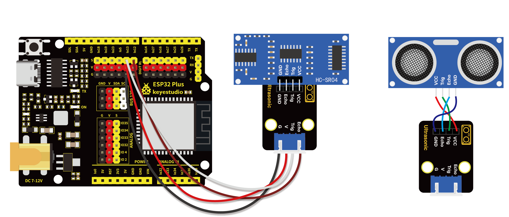
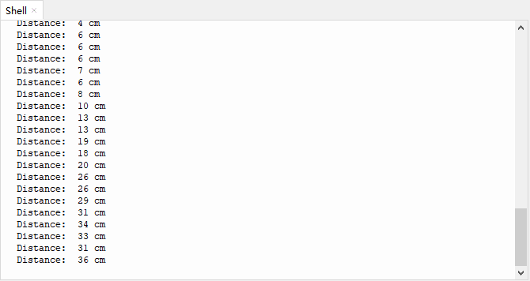

# 第三十五课 超声波传感器的原理

## 1.1 项目介绍

蝙蝠和某些海洋动物都能够利用高频率的声音进行回声定位或信息交流。它们能通过口腔或鼻腔把从喉部产生的超声波发射出去，利用折回的声波来定向，并判定附近物体的位置、大小以及是否在移动。超声波是一种频率高于20000赫兹的声波，它的方向性好，穿透能力强，易于获得较集中的声能，在水中传播距离远，可用于测距、测速、清洗、焊接、碎石、杀菌消毒等。在医学、军事、工业、农业上有很多的应用。超声波因其频率下限大于人的听觉上限而得名。科学家们将每秒钟振动的次数称为声音的频率，它的单位是赫兹(Hz)。

在这个套件中，有一个HC-SR04超声波传感器，它可以发送出一种频率很高的人类无法听到的超声波信号，这些超声波的信号碰到障碍物，就会立刻反射回来。在接收到返回的信息之后，根据发射信号和接收信号的时间差，计算出传感器和障碍物的详细距离，和蝙蝠飞行的原理一样。

---

## 1.2 模块参数

超声波传感器工作电压 : DC 5V 

超声波传感器工作电流 : 15 mA

超声波传感器工作频率 : 40 Hz

超声波传感器射程范围 : 2 cm ~ 4 m

超声波传感器测量角度 : <= 15度

超声波传感器输入触发信号 : 10 uS 的TTL脉冲

超声波传感器输出回响信号 : 输出TTL电平信号与射程成正比

工作温度 ：-10°C ~ +50°C

超声波传感器尺寸 ：45.5 x 26.7 x 17.6 mm

超声波转接板模块尺寸 ：32 x 23.8 x 11.85 mm

超声波转接板模块定位孔大小：直径为 4.8 mm

超声波转接板模块接口 ：间距为2.54 mm 4pin防反接口

---

## 1.3 模块原理图

最常用的超声测距的方法是回声探测法。当有脉冲电压触发时（单片机给Trig引脚发送高电平），超声波发射器探头里的晶片就会振动，继而产生超声波。在超声波发射时刻的同时计数器开始计时，超声波在空气中传播，途中碰到障碍物面阻挡就立即反射回来（Echo引脚发送高电平信号给单片机），超声波接收器收到反射回的超声波就立即停止计时。

超声波是一种声波，其声速V与温度有关。一般情况下超声波在空气中的传播速度为340m/s，根据计时器记录的时间t，就可以计算出超声波探头发射点距障碍物面的距离s，即：s=340t/2 。


HC-SR04超声波测距模块可提供范围为2厘米至4米的非接触式距离感测功能，测距精度可达高到3mm。超声波传感器包括超声波发射器、超声波接收器与控制电路。其基本工作原理：

(1)采用IO口Trig触发测距，给至少10us的高电平信号;

(2)模块自动发送8个40khz的方波，自动检测是否有信号返回；

(3)有信号返回，通过IO口Echo输出一个高电平，高电平持续的时间就是超声波从发射到返回的时间。


---

## 1.4 实验组件

|  |  |  |        |  |
| ------------------------ | ------------------------ | ---------------------------- | ---------------------------- | --------------------- |
| ESP32 Plus主板 x1        | Keyes 超声波转接模块 x1  | HC-SR04 超声波传感器 x1      | XH2.54-4P 转杜邦线母单线  x1 | USB线  x1             |

---

## 1.5 模块接线图



---

## 1.6 在线运行代码

打开Thonny并单击，然后单击“**此电脑**”。

选中“**D:\代码**”路径，打开代码文件''**lesson_35_ultrasonic.py**"。

```python
from machine import Pin
import time

# 定义超声波测距模块的控制引脚
Trig = Pin(13, Pin.OUT, 0) 
Echo = Pin(12, Pin.IN, 0)

distance = 0 # 将初始距离定义为0
soundVelocity = 340 #Set the speed of sound.

# getDistance()函数用于驱动超声波模块测量距离，
# 三角脚保持高电平10us以启动超声波模块
# Echo.value()用于读取超声波模块Echo引脚的状态，
# 然后使用时间模块的时间戳函数计算Echo的持续时间
# 引脚的高电平，根据时间计算测量距离并返回值。
def getDistance():
    Trig.value(1)
    time.sleep_us(10)
    Trig.value(0)
    while not Echo.value():
        pass
    pingStart = time.ticks_us()
    while Echo.value():
        pass
    pingStop = time.ticks_us()
    pingTime = time.ticks_diff(pingStop, pingStart) // 2
    distance = int(soundVelocity * pingTime // 10000)
    return distance

# 延时2秒，等待超声波模块稳定
# 打印每500毫秒从超声波模块获得的数据
time.sleep(2)
while True:
    time.sleep_ms(500)
    distance = getDistance()
    print("Distance: ", distance, "cm")
```

---

## 1.7 实验结果

按照接线图正确接好模块，用USB线连接到计算机上电，单击来执行程序代码。代码开始执行，放置障碍物在超声波传感器探头前感应，"Shell"窗口打印出超声波传感器与障碍物之间的距离值。



---

