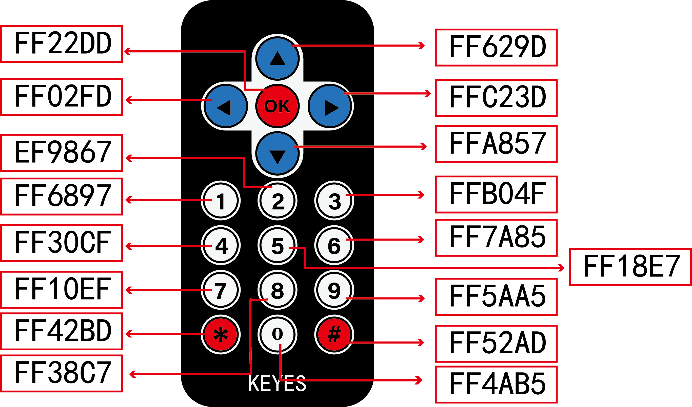
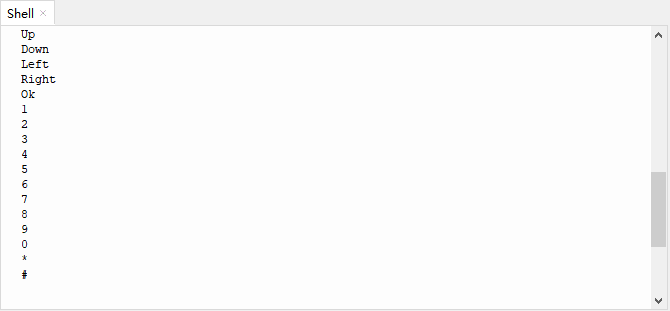

# 第三十六课 红外遥控与接收

## 1.1 项目介绍

红外线遥控是目前使用最广泛的一种通信和遥控手段。因红外线遥控装置具有体积小、功耗低、功能强、成本低等特点，录音机、音响设备、空凋机以及玩具等其它小型电器装置上纷纷采用红外线遥控。红外遥控的发射电路是采用红外发光二极管发出经过调制的红外光波；红外接收电路由红外接收二极管、三极管或硅光电池组成，它们将红外发射器发射的红外光转换为相应的电信号，再送到后置放大器。

Keyes 红外接收模块选择的是VS1838B红外接收传感器元件，该元件是集接收、放大、解调一体的器件，内部IC就已经完成了解调，输出的就是数字信号。它可接收标准38KHz调制的遥控器信号。

---

## 1.2 模块参数

工作电压 : DC 3.3 ~ 5V 

电流 : 50 mA

最大功率 : 0.25 W

工作温度 ：-10°C ~ +50°C

控制信号 : 数字信号

尺寸 ：32 x 23.8 x 10.8 mm

定位孔大小：直径为 4.8 mm

接口 ：间距为2.54 mm 3pin防反接口

---

## 1.3 模块原理图


红外遥控系统的主要部分为调制、发射和接收。红外遥控是以调制的方式发射数据，就是把数据和一定频率的载波进行“与”操作，这样既可以提高发射效率又可以降低电源功耗。调制载波频率一般在30khz到60khz之间，大多数使用的是38kHz，占空比1/3的方波。红外接收的信号端加上了4.7K的上拉电阻R3，工作时，首先等待检测低电平，接收到信号后，信号端立即由高电平转为低电平。

---

## 1.4 实验组件

|  |  |  |        |  |
| ------------------------ | ------------------------ | -------------------------------- | ---------------------------- | --------------------- |
| ESP32 Plus主板 x1        | Keyes 红外接收模块 x1    | Keyes 遥控器 x1                  | XH2.54-3P 转杜邦线母单线  x1 | USB线  x1             |

---

## 1.5 模块接线图


---

## 1.6 在线运行代码

打开Thonny并单击，然后单击“**此电脑**”。

选中“**D:\代码**”路径，打开代码文件''**lesson_36_IR_receiver.py**"。

```python
import utime
from machine import Pin 

ird = Pin(4,Pin.IN)

act = {"1": "LLLLLLLLHHHHHHHHLHHLHLLLHLLHLHHH","2": "LLLLLLLLHHHHHHHHHLLHHLLLLHHLLHHH","3": "LLLLLLLLHHHHHHHHHLHHLLLLLHLLHHHH",
       "4": "LLLLLLLLHHHHHHHHLLHHLLLLHHLLHHHH","5": "LLLLLLLLHHHHHHHHLLLHHLLLHHHLLHHH","6": "LLLLLLLLHHHHHHHHLHHHHLHLHLLLLHLH",
       "7": "LLLLLLLLHHHHHHHHLLLHLLLLHHHLHHHH","8": "LLLLLLLLHHHHHHHHLLHHHLLLHHLLLHHH","9": "LLLLLLLLHHHHHHHHLHLHHLHLHLHLLHLH",
       "0": "LLLLLLLLHHHHHHHHLHLLHLHLHLHHLHLH","Up": "LLLLLLLLHHHHHHHHLHHLLLHLHLLHHHLH","Down": "LLLLLLLLHHHHHHHHHLHLHLLLLHLHLHHH",
       "Left": "LLLLLLLLHHHHHHHHLLHLLLHLHHLHHHLH","Right": "LLLLLLLLHHHHHHHHHHLLLLHLLLHHHHLH","Ok": "LLLLLLLLHHHHHHHHLLLLLLHLHHHHHHLH",
       "*": "LLLLLLLLHHHHHHHHLHLLLLHLHLHHHHLH","#": "LLLLLLLLHHHHHHHHLHLHLLHLHLHLHHLH"}

def read_ircode(ird):
    wait = 1
    complete = 0
    seq0 = []
    seq1 = []

    while wait == 1:
        if ird.value() == 0:
            wait = 0
    while wait == 0 and complete == 0:
        start = utime.ticks_us()
        while ird.value() == 0:
            ms1 = utime.ticks_us()
        diff = utime.ticks_diff(ms1,start)
        seq0.append(diff)
        while ird.value() == 1 and complete == 0:
            ms2 = utime.ticks_us()
            diff = utime.ticks_diff(ms2,ms1)
            if diff > 10000:
                complete = 1
        seq1.append(diff)

    code = ""
    for val in seq1:
        if val < 2000:
            if val < 700:
                code += "L"
            else:
                code += "H"
    # print(code)
    command = ""
    for k,v in act.items():
        if code == v:
            command = k
    if command == "":
        command = code
    return command

while True:
    command = read_ircode(ird)
    print(command)
    utime.sleep(0.5)
```

---

## 1.7 实验结果

Keyes 遥控器上每一个按键都对应着一个按键值，如下图所示。



按照接线图正确接好模块，用USB线连接到计算机上电，单击来执行程序代码。代码开始执行。

找到红外遥控器，拔出绝缘片。对准红外接收模块的红外接收传感器的接收头，按下遥控器任意按键，接收到信号后，“Shell”窗口打印出当前接收到的按键值对应的按键，同时，红外接收传感器上的LED会闪烁。



---

