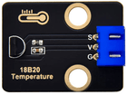

# 第三十七课 DS18B20温度传感器检测温度

## 1.1 项目介绍

在这个套件中，有一个Keyes DS18B20温度传感器，DS18B20 是美国DALLAS公司的一款温度传感器，单片机可以通过 1-Wire 协议与 DS18B20 进行通信，最终将温度读出。测试结果为℃,范围为-55℃到+125℃。

---

## 1.2 模块参数

工作电压 : DC 5V 

电流 : 20 mA

最大功率 : 0.1 W

工作温度 ：-10°C ~ +50°C

测量精度 ：±0.5℃（-10℃至+85℃范围内）

输出信号 : 数字信号

尺寸 ：32 x 23.8 x 9.35 mm

定位孔大小：直径为 4.8 mm

接口 ：间距为2.54 mm 3pin防反接口

---

## 1.3 模块原理图


1-Wire 总线的硬件接口很简单，只需要把 DS18B20 的数据引脚和单片机的一个 IO 口接上就可以了。硬件简单，随之而来的，就是软件时序的复杂。1-Wire总线的时序比较复杂，很多同学在这里独立看时序图都看不明白，我们在库里面已经把复杂的时序操作封装好了，直接使用库函数就可以。我们来看一下 DS18B20 的硬件原理图，如图所示。
DS18B20 通过编程，可以实现最高 12 位的温度存储值，在寄存器中，以补码的格式存储，如下图所示。

---

## 1.4 实验组件

|  |  |        |  |
| ------------------------ | ------------------------ | ---------------------------- | --------------------- |
| ESP32 Plus主板 x1        | DS18B20温度传感器 x1     | XH2.54-3P 转杜邦线母单线  x1 | USB线  x1             |

---

## 1.5 模块接线图


---

## 1.6 在线运行代码

上传代码前先添加库。打开Thonny，在文件管理框单击“**此电脑**”，双击“**（D:）**”，然后双击展开“**代码**”文件夹。展开“**37 DS18B20**”文件夹，右键单击“**ds18x20.py**”，选择“**上传到/**”，等待被上传到ESP32。然后继续右键单击“**onewire.py**”，选择“**上传到/**”，等待被上传到ESP32。

**<span style="background:#ff0;color:#000">注意：在上传代码前先接好模块，否则代码可能上传不成功。</span>**

上传完成后双击打开代码文件''**lesson_37_ds18b20.py**"。

```python
import machine, onewire, ds18x20, time

ds_pin = machine.Pin(13)

ds_sensor = ds18x20.DS18X20(onewire.OneWire(ds_pin))

roms = ds_sensor.scan()

print('Found DS devices: ', roms)

while True:

  ds_sensor.convert_temp()

  time.sleep_ms(750)

  for rom in roms:

    #print(rom)

    print(ds_sensor.read_temp(rom))

  time.sleep(1)
```

---

## 1.7 实验结果

按照接线图正确接好模块，用USB线连接到计算机上电，单击来执行程序代码。代码开始执行，"Shell"窗口打印出当前环境的温度值。


---

## 1.8 代码说明

| 代码                     | 说明         |
| ------------------------ | ------------ |
| ds_sensor.read_temp(rom) | 读取温度值。 |

---

