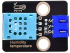

# 第三十八课 XHT11温湿度传感器检测温湿度

## 1.1 项目介绍

在这个套件中，有一个Keyes XHT11温湿度传感器。XHT11作为一款低价的入门级温湿度传感器，它主要由一个电阻式感湿元件和一个NTC测温元件组成。XHT11为4针单排引脚封装，采用单线制串行接口，只需加适当的上拉电阻，信号传输距离可达20米以上，Keyes XHT11温湿度传感器具有超快响应、抗干扰能力强、性价比极高等优点。

---

## 1.2 模块参数

工作电压 : DC 3.3 ~ 5V 

电流 : 50 mA

最大功率 : 0.25 W

工作温度 : -25°C ~ +60°C

温度范围 : 0 ~ 50°C   ± 2℃

湿度范围 : 20%  ~ 90%RH   ± 5%RH

输出信号 : 数字双向单总线

尺寸 ：32 x 23.8 x 9.7 mm

定位孔大小：直径为 4.8 mm

接口 ：间距为2.54 mm 3pin防反接口

---

## 1.3 模块原理图


单片机与 XHT11之间的通讯和同步,采用单总线数据格式,一次通讯时间4ms左右,数据分小数部分和整数部分,具体格式在下面说明,当前小数部分用于以后扩展,现读出为零，操作流程：一次完整的数据传输为40bit，高位先出。

**数据格式：**8bit湿度整数数据+8bit湿度小数数据+8bi温度整数数据+8bit温度小数数据+8bit校验和。

**8位校验和：**8bit湿度整数数据+8bit湿度小数数据+8bi温度整数数据+8bit温度小数数据"相加所得结果的末8位。

---

## 1.4 实验组件

|  |    |        |  |
| ------------------------ | -------------------------- | ---------------------------- | --------------------- |
| ESP32 Plus主板 x1        | Keyes DS18B20温度传感器 x1 | XH2.54-3P 转杜邦线母单线  x1 | USB线  x1             |

---

## 1.5 模块接线图


---

## 1.6 实验代码

打开Thonny并单击，然后单击“**此电脑**”。

选中“**D:\代码**”路径，打开代码文件''**lesson_38_XHT11.py**"。

```python
# 导入机器、时间和dht模块
import machine
import time
import dht

#将DHT11与引脚(15)关联
DHT = dht.DHT11(machine.Pin(13))

# 每秒获取1次温湿度数据并打印
while True:
    DHT.measure() # 启动DHT11测量一次数据
   # 调用DHT的内置函数来获取温度和湿度数据，并打印在“Shell”中
    print('temperature:',DHT.temperature(),'℃','humidity:',DHT.humidity(),'%')
    time.sleep_ms(1000)
```

---

## 1.7 实验结果

按照接线图正确接好模块，用USB线连接到计算机上电，单击来执行程序代码。代码开始执行，"Shell"窗口打印出当前环境的温湿度数据。


---

## 1.8 代码说明

| 代码          | 说明                    |
| ------------- | ----------------------- |
| import dht    | 导入dht模块。           |
| DHT.measure() | 启动DHT11测量一次数据。 |

 
