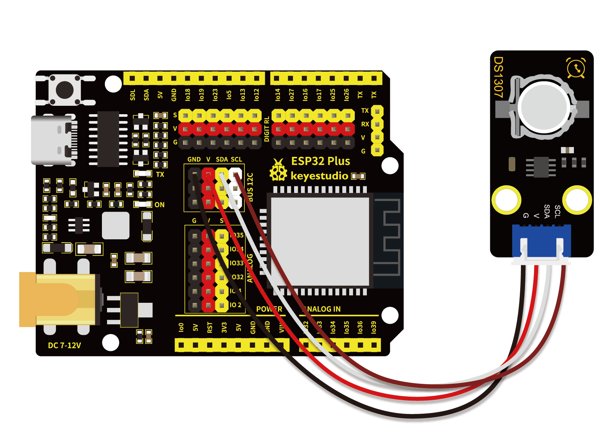
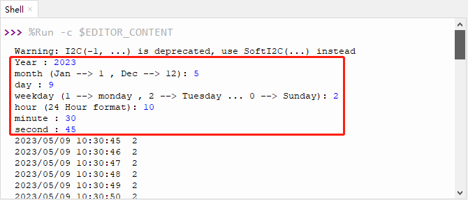

# 第三十六课 DS1307时钟模块

## 1.1 项目介绍

这个模块主要用到的芯片是美国DALLAS公司推出的I2C总线接口实时时钟芯片DS1307，它可独立于CPU工作，不受CPU主晶振及其电容的影响；计时准确，月累积误差一般小于10秒。此芯片还具有主电源掉电情况下的时钟保护电路，DS1307的时钟靠后备电池维持工作，拒绝CPU对其读出和写入访问。同时还具有备用电源自动切换控制电路，因而可在主电源掉电和其它一些恶劣环境场合中保证系统时钟的定时准确性。DS1307具有产生秒、分、时、日、月、年等功能，且具有闰年自动调整功能。同时，DS1307芯片内部还集成有一定容量、具有掉电保护特性的静态RAM，可用于保存一些关键数据。

---

## 1.2 模块参数

中断类型 : 全天时间

存储器容量 : 56 bytes

存储器类型 : RAM

接口类型 : Serial, I2C

时钟频率 : 32.768kHz

特点 : 方波输出

电压, Vcc 最大 : 5V

电源电压 最小 : 4.5V

类型 : RTC

工作温度 ：-10°C ~ +50°C

通讯方式 ：I2C通讯

尺寸 ：47.6 x 23.8 x 7.4 mm

定位孔大小：直径为 4.8 mm

接口 ：间距为2.54 mm 3pin防反接口

---

## 1.3 模块原理图


DS1307 把8 个寄存器和56 字节的RAM 进行了统一编址，记录年、月、日、时、分、秒及星期; AM、PM 分别表示上午和下午; 56 个字节的NVRAM存放数据; 2线串口; 可编程的方波输出;电源故障检测及自动切换电路;电池电流小于500nA。

主要引脚定义如下： 

| DS1307引脚 | 定义                 |
| ---------- | -------------------- |
| X1、X2     | 32.768kHz 晶振接入端 |
| VBAT       | +3V 电池电压输入     |
| VCC        | 电源电压             |
| SQW        | 方波驱动器           |
| SCL        | 串行时钟             |
| SDA        | 串行数据             |

---

## 1.4 实验组件

|  |       |        |  |
| ------------------------ | ----------------------------- | ---------------------------- | --------------------- |
| ESP32 Plus主板 x1        | Keyes DS1307时钟传感器模块 x1 | XH2.54-4P 转杜邦线母单线  x1 | USB线  x1             |

---

## 1.5 模块接线图



---

## 1.6 在线运行代码

打开Thonny并单击，然后单击“**此电脑**”。

选中“**D:\代码**”路径，打开代码文件''**lesson_39_DS1307.py**"。

```python
from machine import I2C, Pin
import time

# 配置I2C总线
i2c = I2C(scl=Pin(22), sda=Pin(21), freq=400000)
#DS1307写入时间已启用
year0 = int(input("Year : "))
month0 = int(input("month (Jan --> 1 , Dec --> 12): "))
day0 = int(input("day : "))
weekday0 = int(input("weekday (1 --> monday , 2 --> Tuesday ... 0 --> Sunday): "))
hours0 = int(input("hour (24 Hour format): "))
minutes0 = int(input("minute : "))
seconds0 = int(input("second : "))
seconds = ((seconds0 // 10) << 4) + (seconds0 % 10)
minutes = ((minutes0 // 10) << 4) + (minutes0 % 10)
hours = ((hours0 // 10) << 4) + (hours0 % 10)
weekday = weekday0 % 7 
day = ((day0 // 10) << 4) + (day0 % 10)
month = ((month0 // 10) << 4) + (month0 % 10)
year = ((year0 - 2000) // 10 << 4) + (year0 - 2000) % 10
#将时间写入DS1307
i2c.writeto_mem(0x68, 0x00, bytes([seconds, minutes, hours, weekday, day, month, year]))

while True:   
    # 发送命令读取当前时间
    i2c.writeto(0x68, bytes([0x00]))

    # 从DS1307读取当前时间
    data = i2c.readfrom(0x68, 7)
    seconds = (data[0] & 0x0f) + ((data[0] & 0x70) >> 4) * 10
    minutes = (data[1] & 0x0f) + ((data[1] & 0x70) >> 4) * 10
    hours = (data[2] & 0x0f) + (((data[2] & 0x30) >> 4) % 2) * 10
    weekday = data[3]
    day = (data[4] & 0x0f) + ((data[4] & 0x30) >> 4) * 10
    month = (data[5] & 0x0f) + ((data[5] & 0x10) >> 4) * 10
    year = (data[6] & 0x0f) + ((data[6] & 0xf0) >> 4) * 10
    print('20{:02}/{:02}/{:02} {:02}:{:02}:{:02} {:2}'.format(year, month, day, hours, minutes, seconds,weekday))
    time.sleep(1)                   
```

---

## 1.7 实验结果

按照接线图正确接好模块，用USB线连接到计算机上电，单击来执行程序代码。代码开始执行。

需要在“Shell”窗口**手动输入年、月、日、周、时、分、秒**，设为初始时间，此后每秒刷新一次时间并打印出来。



---

## 1.8 代码说明

| 代码                                                         | 说明                                      |
| ------------------------------------------------------------ | ----------------------------------------- |
| i2c = I2C(scl=Pin(22), sda=Pin(21), freq=400000)             | 设置I2C的引脚和频率。                     |
| i2c.writeto_mem(0x68, 0x00, bytes([seconds, minutes, hours, weekday, day, month, year])) | 将在“Shell”窗口输入的初始时间写入DS1307。 |

