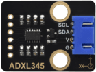

# 第四十课 ADXL345加速度传感器

## 1.1 项目介绍

在这个套件中，有一个Keyes ADXL345加速度传感器模块，它主要由 ADXL345BCCZ 芯片组成。ADXL345BCCZ 是一款小而薄的低功耗3轴加速度计芯片，分辨率高（13位），测量范围达±16g，既能测量运动或冲击导致的动态加速度，也能测量静止加速度，例如重力加速度，使得器件可作为倾斜传感器使用。

---

## 1.2 模块参数

工作电压 ：DC 3.3 ~ 5V

测量范围 ：±16 g

工作温度 ：-10°C ~ +50°C

通讯方式 ：IIC/SPI 通信协议

尺寸 ：47.6 x 23.8 x 9.3 mm

定位孔大小：直径为 4.8 mm

接口 ：间距为2.54 mm 4pin防反接口

---

## 1.3 模块原理图


ADXL345是一款完整的3轴加速度测量系统，可选择的测量范围有±2 g，±4 g，±8 g或±16 g。它数字输出数据为16位二进制补码格式，可通过SPI（3线或4线）或I2C数字接口访问。该传感器可以在倾斜检测应用中测量静态重力加速度，还可以测量运动或冲击导致的动态加速度。其高分辨率(3.9mg/LSB)，能够测量不到1.0°的倾斜角度变化。

---

## 1.4 实验组件

|  |          |        |  |
| ------------------------ | -------------------------------- | ---------------------------- | --------------------- |
| ESP32 Plus主板 x1        | Keyes ADXL345加速度传感器模块 x1 | XH2.54-4P 转杜邦线母单线  x1 | USB线  x1             |

---

## 1.5 模块接线图


---

## 1.6 在线运行代码

上传代码前先添加库。打开Thonny，在文件管理框单击“**此电脑**”，双击“**（D:）**”，然后双击展开“**代码**”文件夹。展开“**40 ADXL345**”文件夹，右键单击“**ADXL345.py**”，选择“**上传到/**”，等待被上传到ESP32。

上传完成后双击打开代码文件''**lesson_40_adxl345_test.py**"。

```python
from machine import Pin
import time
from ADXL345 import adxl345

scl = Pin(22) 
sda = Pin(21)
bus = 0
snsr = adxl345(bus, scl, sda)
while True:
    x,y,z = snsr.readXYZ()
    print('x:',x,'y:',y,'z:',z,'uint:mg')
    time.sleep(0.1)
```

---

## 1.7 实验结果

按照接线图正确接好模块，用USB线连接到计算机上电，单击来执行程序代码。代码开始执行，"Shell"窗口打印出三轴加速度对应的值，单位为mg。


---

## 1.8 代码说明

先设置IIC引脚，然后将所测结果赋值给x、y、z。“Shell”窗口打印出x、y、z的值，单位为mg。

