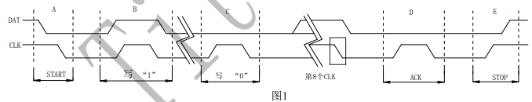
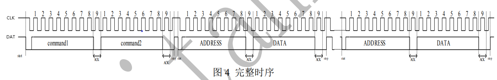
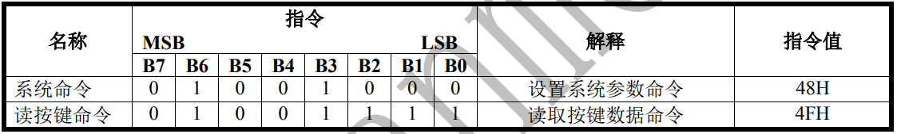

# 第四十一课 TM1650四位数码管模块

## 1.1 项目介绍

Keyes TM1650四位数码管模块选用的 0.36 英寸红色共阴4位数码管的驱动芯片是TM1650。TM1650是一种带键盘扫描接口的LED驱动控制专用电路的芯片。内部集成有MCU输入输出控制数字接口、数据锁存器、LED 驱动、键盘扫描等电路。TM1650性能稳定、质量可靠、抗干扰能力强，可适用于24小时长期连续工作的应用场合。TM1650采用两线串行传输协议通讯（注意：该数据传输协议不是标准的I2C协议）。该芯片只需要通过两个引脚与MCU通讯就可以完成数码管的驱动，可以节省MCU引脚资源。

实验中使用Keyes TM1650四位数码管模块时，我们只需要2根信号线即可使单片机控制4位数码管，大大节约了控制板IO口资源。

---

## 1.2 模块参数

工作电压 : DC 5V 

电流 : 100 mA

最大功率 : 0.5 W

数码管显示颜色 : 红色

LED极性 : 共阴

通讯方式 ：2线高速串行接口（CLK,DAT）

工作温度 ：-10°C ~ +50°C

尺寸 ：47.6 x 23.8 x 10.6 mm

定位孔大小：直径为 4.8 mm

接口 ：间距为2.54 mm 4pin防反接口

---

## 1.3 模块原理图

TM1650与MCU之间的通讯采用2线高速串行接口（CLK,DAT），这两个连线分别是数据线DAT和同步时钟线CLK。其中DAT为双向数据传输线，TM1650既用该线从MCU接收数据，也用该线向MCU发送数据。


实验中我们使用封装好的库函数。
如果大家有兴趣也可以接着往下学习了解 1.3.1 TM1650通讯时序格式和 1.3.2 指令集说明，然后再去了解底层的库函数是如何实现的。

### 1.3.1 TM1650通讯时序格式

TM1650采用下图1 中2线串行传输协议通讯：



（1）开始信号（START）/结束信号(STOP)

开始信号：保持 CLK 为“1”电平，DAT 从“1”跳“0”，认为是开始信号，如上图1的 A 段；
结束信号：保持 CLK 为“1”电平，DAT 从“0”跳“1”，认为是结束信号，如上图1的 E 段；

（2）ACK 信号

如果本次通讯正常，芯片在串行通讯的第 8 个时钟下降沿后，TM1650 主动把 DAT 拉低，直到 CLK 检测到上升沿，DAT 释放为输入状态（对芯片而言）,如上图1的 D 段。

（3） 写“1”和写“0”

写“1”：保持 DAT 为“1”电平，CLK 从“0”跳到“1”,再从“1”跳到“0”，则认为是写入“1” ，如上图 1的 B 段。
写“0”：保持 DAT 为“0”电平，CLK 从“0”跳到“1”,再从“1”跳到“0”，则认为是写入“0” ，如上图 1的 C 段。

（4） 一个字节（8 位）数据传输格式


一个字节数据的传输格式如图上 2，数据发送时 MSB 在前，LSB 在后，即高位先进。微处理器的数据通过 2 线 串行接口和 TM1650 通信，当 CLK 是高电平时，DAT 上的信号必须保持不变；只有 CLK 上的时钟信号为低电平时， DAT 上的信号才能改变。数据输入的开始条件是 CLK 为高电平时，DAT 由高变低；结束条件是 CLK 为高时，DAT 由低电平变为高电平。 

（5）写显示操作


ADDRESS：显示地址（68H、6AH、6CH、6EH）； 
DATA：显示数据。

（6）完整操作时序



command1：系统命令 48H； 
command2：系统参数设置；
ADDRESS：显示地址（68H、6AH、6CH、6EH）；
DATA：显示数据。

备注：
1、设置系统参数和写入显存数据是两个独立的过程，它们之间的顺序不影响实际应用； 
2、每次输入系统命令（48H）和系统参数设置命令都会改变系统参数，请特别注意待机指令操作。

### 1.3.2 指令集说明

（1）数据命令设置 



注意：使用的指令是 16 进制 H，输入数据和读取数据都是从高位开始。

所以在代码中我们数据命令设置为 0x48，使用TM1650点亮数码管的功能，而不使用按键扫描的功能。

（2）显示命令设置


注意：在发送上述系统显示命令前需要先输入系统命令48H,如48H+11H=1级亮度开屏显示。

B[7:0] 这里实际是一个字节数据，只是不同位部分代表不同功能。
B[6:4] ：设置数码管亮度。注意，000 最亮。
B[3]    ：设置是否显示小数点。
B[0]    ：设置数码管的开屏、关屏。

（3） 显存地址


如果要显示小数点，则必须先需要将段模式设置为 8 段输出。


---

## 1.4 实验组件

|  |       |        |  |
| ------------------------ | ----------------------------- | ---------------------------- | --------------------- |
| ESP32 Plus主板 x1        | Keyes TM1650四位数码管模块 x1 | XH2.54-4P 转杜邦线母单线  x1 | USB线  x1             |

---

## 1.5 模块接线图


---

## 1.6 在线运行代码

打开Thonny并单击，然后单击“**此电脑**”。

选中“**D:\代码**”路径，打开代码文件''**lesson_41_TM1650.py**"。

```python
from machine import Pin
import time

# TM1650的定义
ADDR_DIS = 0x48  #加密模式命令
ADDR_KEY = 0x49  #读键值命令

# 亮度的定义
BRIGHT_DARKEST = 0
BRIGHT_TYPICAL = 2
BRIGHTEST      = 7

on  = 1
off = 0

# number:0~9
NUM = [0x3f,0x06,0x5b,0x4f,0x66,0x6d,0x7d,0x07,0x7f,0x6f] 
DIG = [0x6e,0x6c,0x6a,0x68]
DOT = [0,0,0,0]

clkPin = 22
dioPin = 21
clk = Pin(clkPin, Pin.OUT)
dio = Pin(dioPin, Pin.OUT)

DisplayCommand = 0

def writeByte(wr_data):
    global clk,dio
    for i in range(8):
        if(wr_data & 0x80 == 0x80):
            dio.value(1)
        else:
            dio.value(0)
        clk.value(0)
        time.sleep(0.0001)
        clk.value(1)
        time.sleep(0.0001)
        clk.value(0)
        wr_data <<= 1
    return

def start():
    global clk,dio
    dio.value(1)
    clk.value(1)
    time.sleep(0.0001)
    dio.value(0)
    return
    
def ack():
    global clk,dio
    dy = 0
    clk.value(0)
    time.sleep(0.0001)
    dio = Pin(dioPin, Pin.IN)
    while(dio.value() == 1):
        time.sleep(0.0001)
        dy += 1
        if(dy>5000):
            break
    clk.value(1)
    time.sleep(0.0001)
    clk.value(0)
    dio = Pin(dioPin, Pin.OUT)
    return 
    
def stop():
    global clk,dio
    dio.value(0)
    clk.value(1)
    time.sleep(0.0001)
    dio.value(1)
    return
    
def displayBit(bit, num):
    global ADDR_DIS
    if(num > 9 and bit > 4):
        return
    start()
    writeByte(ADDR_DIS)
    ack()
    writeByte(DisplayCommand)
    ack()
    stop()
    start()
    writeByte(DIG[bit-1])
    ack()
    if(DOT[bit-1] == 1):
        writeByte(NUM[num] | 0x80)
    else:
        writeByte(NUM[num])
    ack()
    stop()
    return
    
def clearBit(bit):
    if(bit > 4):
        return
    start()
    writeByte(ADDR_DIS)
    ack()
    writeByte(DisplayCommand)
    ack()
    stop()
    start()
    writeByte(DIG[bit-1])
    ack()
    writeByte(0x00)
    ack()
    stop()
    return
    
    
def setBrightness(b = BRIGHT_TYPICAL):
    global DisplayCommand,brightness
    DisplayCommand = (DisplayCommand & 0x0f)+(b<<4)
    return

def setMode(segment = 0):
    global DisplayCommand
    DisplayCommand = (DisplayCommand & 0xf7)+(segment<<3)
    return
    
def displayOnOFF(OnOff = 1):
    global DisplayCommand
    DisplayCommand = (DisplayCommand & 0xfe)+OnOff
    return

def displayDot(bit, OnOff):
    if(bit > 4):
        return
    if(OnOff == 1): 
        DOT[bit-1] = 1;
    else:
        DOT[bit-1] = 0;
    return
        
def InitDigitalTube():
    setBrightness(2)
    setMode(0)
    displayOnOFF(1)
    for _ in range(4):
        clearBit(_)
    return

def ShowNum(num): #0~9999
    displayBit(1,num%10)
    if(num < 10):
        clearBit(2)
        clearBit(3)
        clearBit(4)
    if(num > 9 and num < 100):
        displayBit(2,num//10%10)
        clearBit(3)
        clearBit(4)
    if(num > 99 and num < 1000):
        displayBit(2,num//10%10)
        displayBit(3,num//100%10)
        clearBit(4)
    if(num > 999 and num < 10000):
        displayBit(2,num//10%10)
        displayBit(3,num//100%10)
        displayBit(4,num//1000)

InitDigitalTube()

while True:
    #displayDot(1,on)     # 开或关, DigitalTube.Display(bit,number); bit=1---4  number=0---9
    for i in range(0,9999):
        ShowNum(i)
        time.sleep(0.01)
```

---

## 1.7 实验结果

按照接线图正确接好模块，用USB线连接到计算机上电，单击来执行程序代码。代码开始执行，能看到4位数码管显示数字，从0开始，每10毫秒加1，直至加到9999后又从0开始循环。


---

## 1.8 代码说明

| 代码                              | 说明                         |
| --------------------------------- | ---------------------------- |
| clearBit(bit)                     | 清除bit(1~4)位显示。         |
| setBrightness(b = BRIGHT_TYPICAL) | 亮度设置。                   |
| DigitalTube.clearBit(b)           | 清除位显示。                 |
| displayOnOFF(OnOff = 1)           | 显示小数点，0为关，1为开。   |
| ShowNum(num)                      | 显示整数num，范围为0~9999 。 |

 
