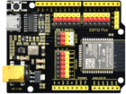

# 第四十二课 HT16K33_8X8点阵模块

## 1.1 项目介绍

点阵，多个LED组成的阵列，他们的集合称为“阵”，其中单个单元称为“点”。8X8点阵共由64个发光二极管组成，且每个发光二极管是放置在行线和列线的交叉点上。

第二课我们学习了一个IO口控制一个led，这节课我们来学习用更少的IO口控制更多的led。

---

## 1.2 模块参数

工作电压 : DC 5V 

电流 : 200 mA

最大功率 : 1 W

工作温度 ：-10°C ~ +50°C

通讯方式 ：I2C通讯

I2C通信地址 ：0X70

点阵屏显示颜色 ：蓝色

尺寸 ：32 x 23.8 x 7.4 mm

定位孔大小：直径为 4.8 mm

接口 ：间距为2.54 mm 4pin防反接口

---

## 1.3 模块原理图


如原理图所示，如果想要点亮第一行第一列的LED灯，只需要将C1置高电平、R1置低电平就可以了。如果我们想让第一行led全部点亮，只需要将R1置为低电平，C1~C8全部置为高电平就可以了。原理非常简单，但是这样设置的话我们总共需要用到16个IO口，非常浪费单片机资源。为了节省IO口不浪费单片机资源，我们特别设计了这个HT16K33_8X8点阵模块，利用HT16K33芯片驱动1个8*8点阵，只需要利用单片机的I2C通信端口就能控制点阵的64个发光二极管。

我们这款Keyes HT16K33_8X8点阵模块已经固定了通信地址，地址为0x70。

---

## 1.4 实验组件

|  |      |        |  |
| ------------------------ | ---------------------------- | ---------------------------- | --------------------- |
| ESP32 Plus主板 x1        | Keyes HT16K33_8X8点阵模块 x1 | XH2.54-4P 转杜邦线母单线  x1 | USB线  x1             |

---

## 1.5 模块接线图


---

## 1.6 在线运行代码

上传代码前先添加库。打开Thonny，在文件管理框单击“**此电脑**”，双击“**（D:）**”，然后双击展开“**代码**”文件夹。展开“**42 HT16K33 dot matrix**”文件夹，右键单击“**ht16k33.py**”，选择“**上传到/**”，等待被上传到ESP32。然后继续右键单击“**ht16k33matrix.py**”，选择“**上传到/**”，等待被上传到ESP32。

**<span style="background:#ff0;color:#000">注意：在上传代码前先接好模块，否则代码可能上传不成功。</span>**

上传完成后双击打开代码文件''**lesson_42_matrix_dot.py**"。

```python
import utime as time
from machine import I2C, Pin, RTC
from ht16k33matrix import HT16K33Matrix

# 常量
DELAY = 0.01
PAUSE = 3

# 初始
if __name__ == '__main__':
    i2c = I2C(scl=Pin(22), sda=Pin(21))
    display = HT16K33Matrix(i2c)
    display.set_brightness(2)

    # 在LED上绘制自定义图标
    icon = b"\x00\x66\x00\x00\x18\x42\x3c\x00"
    display.set_icon(icon).draw()
    display.set_angle(0).draw()
    time.sleep(PAUSE)
```

---

## 1.7 实验结果

按照接线图正确接好模块，用USB线连接到计算机上电，单击来执行程序代码。代码开始执行，HT16K33_8X8点阵模块显示“笑脸”图案。


若代码上传成功后点阵屏不显示“笑脸”图案，尝试按一下RESET键。


---

