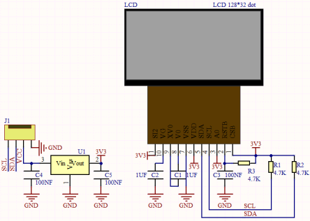

# 第四十三课 LCD_128X32_DOT模块

## 1.1 项目介绍

在这个套件中，有一个Keyes LCD_128X32_DOT模块，它是一个像素为128*32的液晶屏模块，驱动芯片为 ST7567A。此模块使用IIC通信方式。我们提供了包含所有英文字母和常用符号的库，可以直接调用，还能设置大小。为了方便设置图案显示，我们还提供一个取模软件，可将特定的图案转化成控制代码，在测试代码中使用。

---

## 1.2 模块参数

工作电压 ：DC 5V

分辨率 ：128 X 32

电流 ：100 mA

最大功率 ：0.5W

工作温度 ：0°C ~ +40°C

通讯方式 ：IIC/SPI 通信协议

尺寸 ：47.6 x 23.8 x 9.3 mm

定位孔大小：直径为 4.8 mm

接口 ：间距为2.54 mm 4pin防反接口

---

## 1.3 模块原理图



该模块使用IIC通讯原理，底层函数已经封装在库里面，直接调用库函数就可以。如果感兴趣的话可以自行了解底层驱动。

---

## 1.4 实验组件

|  |     |        |  |
| ------------------------ | --------------------------- | ---------------------------- | --------------------- |
| ESP32 Plus主板 x1        | Keyes LCD_128X32_DOT模块 x1 | XH2.54-4P 转杜邦线母单线  x1 | USB线  x1             |

---

## 1.5 模块接线图


---

## 1.6 在线运行代码

上传代码前先添加库。打开Thonny，在文件管理框单击“**此电脑**”，双击“**（D:）**”，然后双击展开“**代码**”文件夹。展开“**43 lcd128_32**”文件夹，右键单击“**lcd128_32_fonts.py**”，选择“**上传到/**”，等待被上传到ESP32。然后继续用相同的操作将“**lcd128_32.py**”上传到ESP32。

**<span style="background:#ff0;color:#000">注意：在上传代码前先接好模块，否则代码可能上传不成功。</span>**

选中“**D:\代码**”路径，打开代码文件''**lesson_43_lcd128_32_test.py**"。

```python
import machine
import time 
import lcd128_32_fonts
from lcd128_32 import lcd128_32

#i2c配置
clock_pin = 22
data_pin = 21
bus = 0
i2c_addr = 0x3f
use_i2c = True

def scan_for_devices():
    i2c = machine.I2C(bus,sda=machine.Pin(data_pin),scl=machine.Pin(clock_pin))
    devices = i2c.scan()
    if devices:
        for d in devices:
            print(hex(d))
    else:
        print('no i2c devices')

if use_i2c:
    scan_for_devices()
    lcd = lcd128_32(data_pin, clock_pin, bus, i2c_addr)


lcd.Clear()

lcd.Cursor(0, 7)
lcd.Display("KEYES")
lcd.Cursor(1, 0)
lcd.Display("ABCDEFGHIJKLMNOPQR")
lcd.Cursor(2, 0)
lcd.Display("123456789+-*/<>=$@")
lcd.Cursor(3, 0)
lcd.Display("%&(){}:;'|?,.~\\[]")

while True:
    #scan_for_devices()
    time.sleep(0.5)
```

---

## 1.7 实验结果

按照接线图正确接好模块，用USB线连接到计算机上电，单击来执行程序代码。

代码开始执行，模块显示屏第一行显示“**KEYES**”、第二行显示“**ABCDEFGHIJKLMNOPQR**”、第三行显示“**123456789+-*/<>=$@**”、第四行显示“**%^&(){}:;'|?,.~\\[]**”。


---

## 1.8 代码说明

| 代码              | 说明           |
| ----------------- | -------------- |
| lcd.Init()        | 初始化显示屏。 |
| lcd.Clear()       | 清除显示。     |
| lcd.Cursor(  ,  ) | 设置显示位置。 |
| lcd.Display("  ") | 设置显示字符。 |

 
