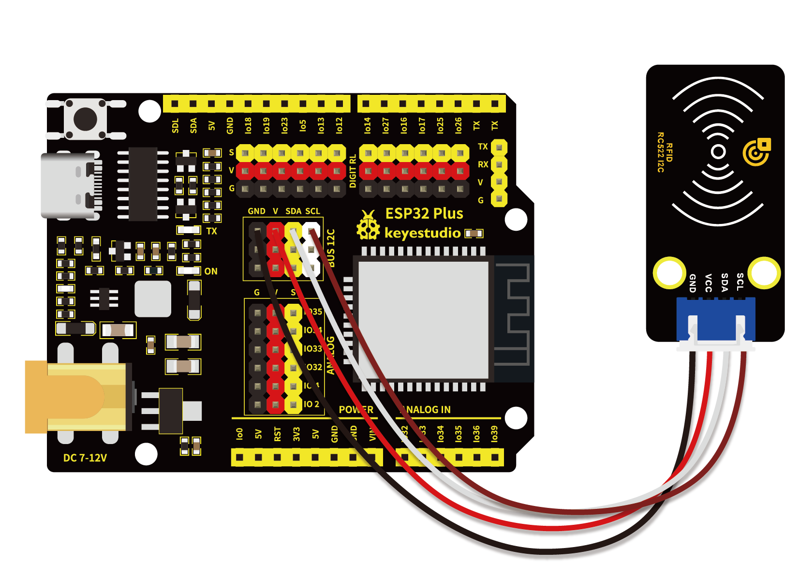
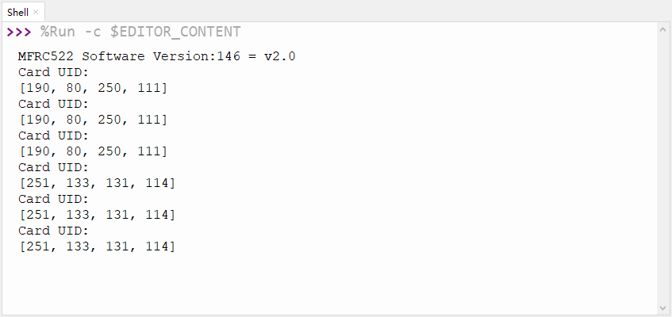

# 第四十四课 RFID刷卡模块

## 1.1 项目介绍

在这个套件中，有一个Keyes RFID刷卡模块。RFIDRFID-RC522射频模块采用Philips MFRC522原装芯片设计读卡电路，使用方便，成本低廉，适用于设备开发、读卡器开发等高级应用的用户，也适用于需要进行射频卡终端设计/生产的用户。本模块可直接装入各种读卡器模具,通过IIC接口简单的2条线就可以直接与用户任何CPU主板或单片机相连接通信。
实验中用刷卡模块读取到的数据是4个16进制数，我们把这四个16进制数串以字符串的形式打印出来。例如本实验中读取到的IC卡的数据为：0xED、0xF7、0x94、0x5A，在串口监视器显示出信息字符串就是ED F7 94 5A；读取钥匙扣的数据为：0x4C、0x09、0x6B、0x6E，在串口监视器打印出来的信息字符串就是4C 09 6B 6E。有时候看到的不是两位数，是因为前面有个0省略了，如0a它显示的就是a。不同的IC卡和钥匙扣，其数据是不一样的。

---

## 1.2 模块参数

工作电压 : DC 5V 

工作电流 : 13 ~ 100 mA /DC 5V 

空闲电流 : 10 ~ 13 mA /DC 5V

休眠电流 : < 80 uA

峰值电流 : < 100 mA

工作频率 : 13.56 MHz

最大功率 : 0.5 W

支持的卡类型：mifare1 S50、mifare1 S70、mifare UltraLight、mifare Pro、mifare Desfire

数据传输速率：最大10Mbit/s

工作温度 ：-10°C ~ +50°C

尺寸 ：47.6 x 23.8 x 9.3 mm

定位孔大小：直径为 4.8 mm

接口 ：间距为2.54 mm 4pin防反接口

---

## 1.3 模块原理图


RFID（Radio Frequency Identification）：无线射频识别，读卡器由频射模块及高平磁场组成。Tag应答器为待感应设备，此设备不包含电池。他只包含微型集成电路芯片及存储数据的介质以及接收和发送信号的天线。读取tag中的数据，首先要放到读卡器的读取范围内。读卡器会产生一个磁场，因为磁能生电由楞次定律，RFID Tag就会供电，从而激活设备。


---

## 1.4 实验组件

|  |  |        |
| ------------------------ | ------------------------ | ---------------------------- |
| ESP32 Plus主板 x1        | Keyes RFID刷卡模块 x1    | XH2.54-4P 转杜邦线母单线  x1 |
|     |     |           |
| USB线  x1                | 钥匙扣  x1               | IC卡  x1                     |

---

## 1.5 模块接线图



---

## 1.6 在线运行代码

上传代码前先添加库。打开Thonny，在文件管理框单击“**此电脑**”，双击“**（D:）**”，然后双击展开“**代码**”文件夹。展开“**44 RFID RC522**”文件夹，右键单击“**mfrc522_config.py**”，选择“**上传到/**”，等待被上传到ESP32。然后继续用相同的操作将“**mfrc522_i2c.py**”和“**soft_iic.py**”上传到ESP32。

**<span style="background:#ff0;color:#000">注意：在上传代码前先接好模块，否则代码可能上传不成功。</span>**

选中“**D:\代码**”路径，打开代码文件''**lesson_44_mfrc522.py**"。

```python
import machine
import time
from mfrc522_i2c import mfrc522

#i2c配置
addr = 0x28
scl = 22
sda = 21
    
rc522 = mfrc522(scl, sda, addr)
rc522.PCD_Init()
rc522.ShowReaderDetails()    # 显示PCD - MFRC522读卡器的详细信息

while True:
    if rc522.PICC_IsNewCardPresent():
        if rc522.PICC_ReadCardSerial() == True:
            print("Card UID:")
            print(rc522.uid.uidByte[0 : rc522.uid.size])
    #time.sleep(1)
```

---

## 1.7 实验结果

按照接线图正确接好模块，用USB线连接到计算机上电，单击来执行程序代码。

代码开始执行，用IC卡和钥匙扣靠近RFID模块，"Shell"窗口打印出RFID刷卡模块读取到的数据信息。



**注意：不同的IC卡和钥匙扣，其数据是不一样的。**<span style="background:#ff0;color:#000">请记录下你的IC卡和钥匙扣的UID码，第59课会用到。</span>

若代码上传成功后串口监视器不打印数据信息，尝试按一下RESET键。


---

## 1.8 代码说明

| 库名称            | 说明                                                 |
| ----------------- | ---------------------------------------------------- |
| mfrc522_config.py | 这是一个配置文件，里面定义了一些参数和命令。         |
| mfrc522_i2c.py    | 是一些初始化和读写函数。                             |
| Soft_iic.py       | 是软件I2C的底层读写函数，我们这里用的是io口模拟I2C。 |

