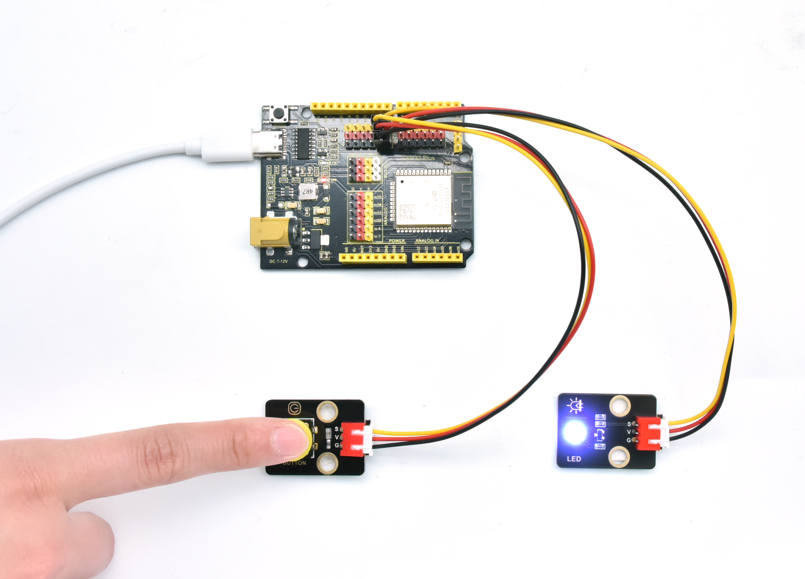

# 第四十五课 按键控制LED灯

## 1.1 项目介绍

从前面的实验课程中我们学习了按键模块，按下按键我们的单片机读取到低电平，松开按键读取到高电平。在这一实验课程中，我们将按键模块和紫色LED模块组合实验，实现按下按键LED点亮，再次按下按键LED熄灭，再次按下再次点亮的效果。

---

## 1.2 实验组件

|  |  |  |        |  |
| ------------------------ | ------------------------ | ------------------------ | ---------------------------- | --------------------- |
| ESP32 Plus主板 x1        | Keyes 单路按键模块 x1    | Keyes 紫色LED模块 x1     | XH2.54-3P 转杜邦线母单线  x2 | USB线  x1             |

---

## 1.3 实验接线图


---

## 1.4 在线运行代码

打开Thonny并单击，然后单击“**此电脑**”。

选中“**D:\代码**”路径，打开代码文件''**lesson_45_button_control_LED.py**"。

```python
from machine import Pin
import time

led = Pin(12, Pin.OUT) # 从引脚12创建LED对象，设置引脚12输出             
button = Pin(13, Pin.IN, Pin.PULL_UP) #从GP13创建按钮对象，设置GP13为输入

#自定义一个函数并将其命名为reverseGPIO()，它将反转LED的输出电平
def reverseGPIO():
    if led.value():
        led.value(0)     #设置led关闭
    else:
        led.value(1)     #设置led开启

try:
    while True:
        if not button.value():
            time.sleep_ms(20)
            if not button.value():
                reverseGPIO()
                while not button.value():
                    time.sleep_ms(20)
except:
    pass
```

---

## 1.5 实验结果

按照接线图正确接好模块，用USB线连接到计算机上电，单击来执行程序代码。代码开始执行，按下按键，LED点亮，再次按下，LED熄灭。循环进行。

单击或按Ctrl+C退出程序。




---

