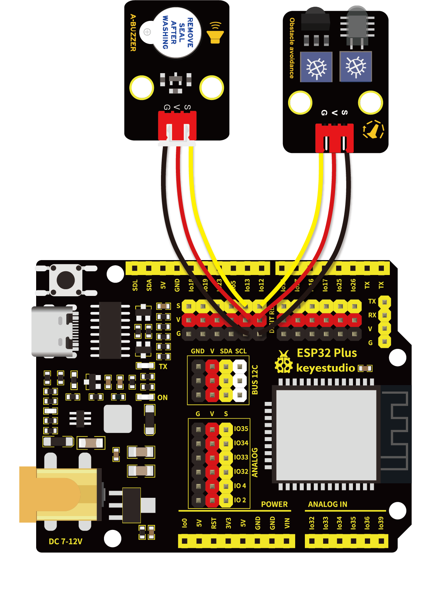

# 第四十六课 障碍物报警实验

## 1.1 项目介绍

在前面实验课程中中，我们使用一个输入模块控制另一个输出模块。在这一实验中，我们还是用一个模块控制另一个模块。

生活中，我们可以利用一个检测传感器控制一个有源蜂鸣器响起或者LED点亮，做声光报警设备，如检测磁场（干簧管）、检测倾斜（倾斜模块）等等。这一实验课程中我们将避障传感器和有源蜂鸣器模块组合实验，实现避障传感器检测到障碍物时有源蜂鸣器响起的效果。

---

## 1.2 实验组件

|  |  |  |        |  |
| ------------------------ | ------------------------ | ------------------------ | ---------------------------- | --------------------- |
| ESP32 Plus主板 x1        | Keyes 避障传感器 x1      | Keyes 有源蜂鸣器模块 x1  | XH2.54-3P 转杜邦线母单线  x2 | USB线  x1             |

---

## 1.3 实验接线图



---

## 1.4 在线运行代码

打开Thonny并单击，然后单击“**此电脑**”。

选中“**D:\代码**”路径，打开代码文件''**lesson_46_Avoiding_alarm.py**"。

```python
from machine import Pin
import time

buzzer = Pin(13, Pin.OUT)
sensor = Pin(12, Pin.IN)
while True:
    buzzer.value(not(sensor.value()))
    time.sleep(0.01)
```

---

## 1.5 实验结果

按照接线图正确接好模块，用USB线连接到计算机上电，单击来执行程序代码。代码开始执行，当避障传感器检测到障碍物时，避障传感器上SLED灯亮起，同时有源蜂鸣器发出声响；当避障传感器检测不到障碍物时，有源蜂鸣器停止发出声响。


---

