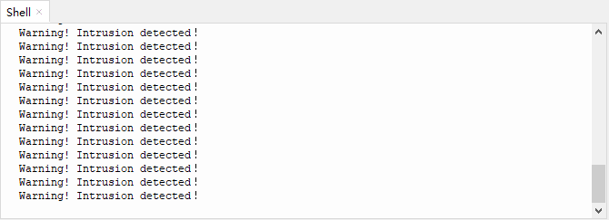

# 第四十七课 入侵检测报警器

## 1.1 项目介绍

上一课实验中我们学习了使用避障传感器检测障碍物进行报警提醒。在这一实验课程中我们将人体红外热释传感器、紫色LED模块和有源蜂鸣器模块组合实验，实现人体红外热释传感器检测到附近有人经过时有源蜂鸣器响起，紫色LED快速闪烁的效果。

---

## 1.2 实验组件

|  |      |  |
| ------------------------ | ---------------------------- | ------------------------ |
| ESP32 Plus主板 x1        | Keyes 人体红外热释传感器 x1  | Keyes 有源蜂鸣器模块 x1  |
|  |        |     |
| Keyes 紫色LED模块 x1     | XH2.54-3P 转杜邦线母单线  x3 | USB线  x1                |

---

## 1.3 模块接线图


---

## 1.4 在线运行代码

打开Thonny并单击，然后单击“**此电脑**”。

选中“**D:\代码**”路径，打开代码文件''**lesson_47_PIR_alarm.py**"。

```python
#导入引脚和时间模块
from machine import Pin 
import time 

# 定义人体红外传感器，led和主动蜂鸣器的引脚
sensor_pir = Pin(12, Pin.IN)
led = Pin(5, Pin.OUT)
buzzer = Pin(13, Pin.OUT)

while True: 
      if sensor_pir.value():
          print("Warning! Intrusion detected！")
          buzzer.value(1)
          led.value(1)
          time.sleep(0.2)
          buzzer.value(0)
          led.value(0)
          time.sleep(0.2)         
      else:
          buzzer.value(0)
          led.value(0)
```

---

## 1.5 实验结果

按照接线图正确接好模块，用USB线连接到计算机上电，单击来执行程序代码。代码开始执行，当人体红外热释传感器检测到附近有人经过时，人体红外热释传感器上的红灯灭，有源蜂鸣器发出警报，紫色LED灯快速闪烁，“Shell”窗口打印出“**Warning! Intrusion detected！**”。

单击或按Ctrl+C退出程序。




---

