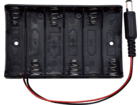
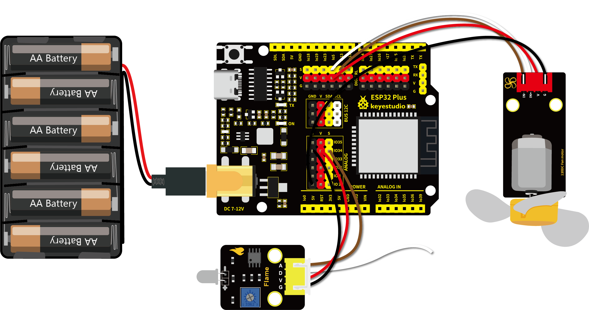

# 第四十八课 模拟灭火机器人

## 1.1 项目介绍

你知道灭火机器人吗？根据国家犯罪记录局（NCRB）的估计，从2010年至2014年，印度发生的火灾事故已造成超过120万死亡。即使为火灾事故采取了许多预防措施，但这些自然/人为灾难却还是时有发生。发生火灾时，为了营救人员和灭火，非常需要消防员等人力资源。随着技术的进步、机器人技术的发展，未来很有可能使用机器人代替消防员灭火。这将提高灭火的效率，也能保障消防员的生命安全。

在这个项目中，我们将学习如何使用ESP32主板构建一个非常简单的机器人。用火焰传感器检测火焰，并启动130电机吹灭火源。

---

## 1.2 实验组件

|  |  |  |           |
| ------------------------ | ------------------------ | ------------------------ | ---------------------------- |
| ESP32 Plus主板 x1        | Keyes 130电机模块 x1     | Keyes 火焰传感器 x1      | XH2.54-4P 转杜邦线母单线  x2 |
|        |     |          |                              |
| USB线  x1                | 6节5号电池盒  x1         | 5号电池**(自备)**  x6    |                              |

---

## 1.3 模块接线图



**注意：130电机模块的GND线一定要接到图示位置，电池盒也必须接上，否则容易造成瞬时电流过大。**

---

## 1.4 在线运行代码

打开Thonny并单击，然后单击“**此电脑**”。

选中“**D:\代码**”路径，打开代码文件''**48_Fire_fighting_robot.py**"。

```python
# 导入引脚和ADC模块
from machine import ADC,Pin
import time

# 开启并配置ADC，量程为0-3.3V
adc=ADC(Pin(34))
adc.atten(ADC.ATTN_11DB)
adc.width(ADC.WIDTH_12BIT)

# 电机的两个引脚
INA = Pin(5, Pin.OUT) # INA对应IN+
INB = Pin(13, Pin.OUT)# INB对应IN-

while True:
    adcVal=adc.read()
    print(adcVal)
    if adcVal < 3000:
        # 开启
        INA.value(0)
        INB.value(1)
    else:
        # 停止
        INA.value(0)
        INB.value(0)
    time.sleep(0.1)
```

---

## 1.5 实验结果

由于风扇在转动时，所需的电流比其他传感器要大，会引起电路中电压电流波动，特别是风扇进行正反转时，电压电流波动过大，导致ESP32开发板的电压电流过低，会导致复位。

按照接线图正确接好模块，用USB线连接到计算机上电，单击来执行程序代码。

"Shell"窗口打印出火焰的ADC值，当ADC值低于3000时打开风扇灭火；当ADC值高于3000时关闭风扇。这个ADC阈值可以根据实际情况设置。


---

## 1.6 代码说明

在代码中我们设置了阈值为3000（item < 3000），阈值可以根据实际情况更改。当火焰传感器检测到ADC值低于这个阈值时，风扇将自动开启；否则关闭。风扇的驱动方式请查看课程十八。
