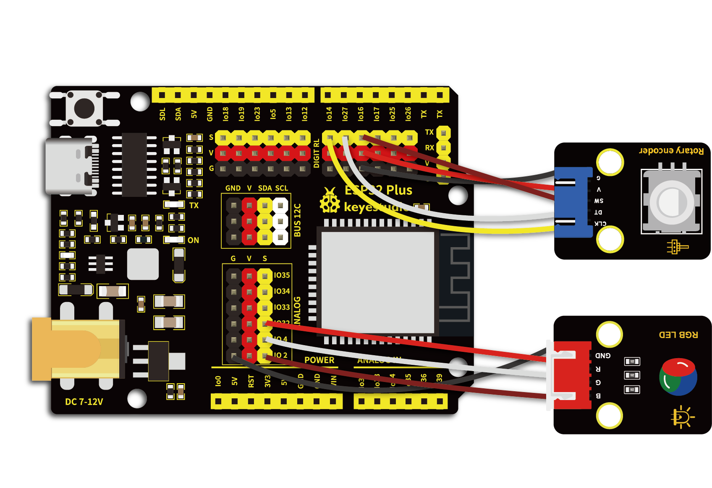

# 第四十九课 旋转编码器控制RGB

## 1.1 项目介绍

在第三十三课的实验中我们学习了使用旋转编码器计数。在这一实验课程中我们将旋转编码器模块和共阴RGB模块组合实验，通过旋转编码器计数的结果，控制RGB模块上LED显示不同的颜色。

---

## 1.2 实验组件

|      |      |  |
| ---------------------------- | ---------------------------- | ------------------------ |
| ESP32 Plus主板 x1            | Keyes 旋转编码器模块 x1      | Keyes 共阴RGB模块 x1     |
|        |        |     |
| XH2.54-5P 转杜邦线母单线  x1 | XH2.54-4P 转杜邦线母单线  x1 | USB线  x1                |

---

## 1.3 模块接线图



---

## 1.4 在线运行代码

上传代码前先添加库。打开Thonny，在文件管理框单击“**此电脑**”，双击“**（D:）**”，然后双击展开“**代码**”文件夹。展开“**49 Encoder control RGB**”文件夹，右键单击“**rotary.py**”，选择“**上传到/**”，等待被上传到ESP32。然后继续右键单击“**rotary_irq_rp2.py**”，选择“**上传到/**”，等待被上传到ESP32。

上传完成后双击打开代码文件''**lesson_49_Encoder_control_RGB.py**"。

```python
import time
from rotary_irq_rp2 import RotaryIRQ
from machine import Pin, PWM

pwm_r = PWM(Pin(32)) 
pwm_g = PWM(Pin(4))
pwm_b = PWM(Pin(2))

pwm_r.freq(1000)
pwm_g.freq(1000)
pwm_b.freq(1000)

def light(red, green, blue):
    pwm_r.duty(red)
    pwm_g.duty(green)
    pwm_b.duty(blue)

SW=Pin(16,Pin.IN,Pin.PULL_UP)
r = RotaryIRQ(pin_num_clk=14,
              pin_num_dt=27,
              min_val=0,
              reverse=False,
              range_mode=RotaryIRQ.RANGE_UNBOUNDED)

while True:
    val = r.value()
    print(val%3)
    if val%3 == 0:
        light(1023, 0, 0)
    elif val%3 == 1:
        light(0, 1023, 0)
    elif val%3 == 2:
        light(0, 0, 1023)
    time.sleep(0.1)
```

---

## 1.5 实验结果

按照接线图正确接好模块，用USB线连接到计算机上电，单击来执行程序代码。代码开始执行，任意方向旋转编码器，串口监视器打印出对应余数；RGB模块上的LED显示余数对应的颜色：余数0显示红色、余数1显示绿色、余数2显示蓝色。按下旋转编码器，RGB模块上LED保持当前颜色不变。

单击或按Ctrl+C退出程序。


---

