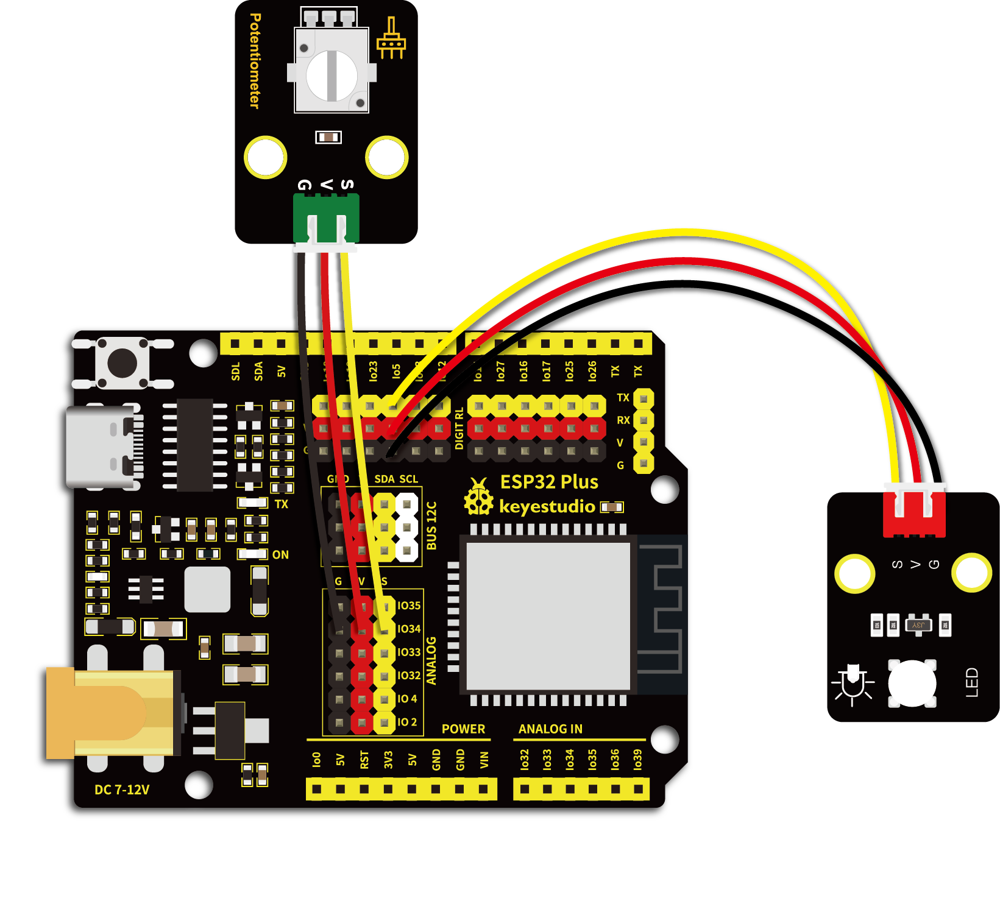

# 第五十课 电位器调节灯光亮度

## 1.1 项目介绍

从前面的课程实验中我们学习了设计呼吸灯和按键控制LED灯。在这一实验课程中我们尝试将呼吸灯和按键控制LED灯这两个实验现象组合起来，用可调电位器代替按键，实现利用旋转可调电位器读取到的模拟值控制紫色LED亮度的效果。可调电位器模拟值的范围是0 ~ 4095；LED的亮度由PWM值控制，范围为0 ~ 255。

---

## 1.2 实验组件

|  |   |  |        |  |
| ------------------------ | ------------------------- | ------------------------ | ---------------------------- | --------------------- |
| ESP32 Plus主板 x1        | Keyes 旋转电位器传感器 x1 | Keyes 紫色LED模块 x1     | XH2.54-3P 转杜邦线母单线  x2 | USB线  x1             |

---

## 1.3 模块接线图



---

## 1.4 在线运行代码

打开Thonny并单击，然后单击“**此电脑**”。

选中“**D:\代码**”路径，打开代码文件''**lesson_50_adjust_the_light.py**"。

```python
from machine import Pin,PWM,ADC
import time

pwm =PWM(Pin(5,Pin.OUT),1000)
adc=ADC(Pin(34))
adc.atten(ADC.ATTN_11DB)
adc.width(ADC.WIDTH_10BIT)

try:
    while True:
        adcValue=adc.read()
        pwm.duty(adcValue) 
        print(adc.read())
        time.sleep_ms(100)
except:
    pwm.deinit()
```

---

## 1.5 实验结果

按照接线图正确接好模块，用USB线连接到计算机上电，单击来执行程序代码。代码开始执行，旋转电位器，可以调节紫色LED的亮度，“Shell”窗口打印出当前PWM的值。

单击或按Ctrl+C退出程序。


---

