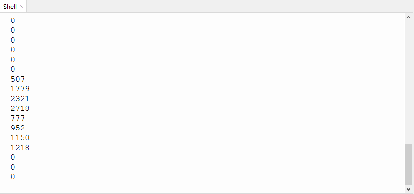

# 第五十一课 模拟智能窗户

## 1.1 项目介绍

生活中能看到各种各样的智能产品，例如智能窗帘、智能窗户、智能电视、智能灯光等等。这一课我们来学习做一个智能窗帘，利用水滴水蒸气传感器模块检测雨水，然后通过设置舵机的角度来达到关窗和开窗的效果。

当然，这只是我们模拟的一个场景，主要用于加深我们的印象，达到对模块学以致用的效果。现实生活中，智能窗户并不是使用舵机来开关的。

---

## 1.2 实验组件

|  |  |  |        |  |
| ------------------------ | ------------------------ | -------------------- | ---------------------------- | --------------------- |
| ESP32 Plus主板 x1        | Keyes 水滴传感器 x1      | 9G 180度数字舵机 x1  | XH2.54-3P 转杜邦线母单线  x1 | USB线  x1             |

---

## 1.3 模块接线图


---

## 1.4 在线运行代码

打开Thonny并单击，然后单击“**此电脑**”。

选中“**D:\代码**”路径，打开代码文件''**lesson_51_Smart_window.py**"。

```python
# 导入引脚和ADC模块
from machine import ADC,Pin,PWM
import time 

# 开启并配置ADC，量程为0-3.3V
adc=ADC(Pin(34))
adc.atten(ADC.ATTN_11DB)
adc.width(ADC.WIDTH_12BIT)

pwm = PWM(Pin(4))#转向销连接到GP4
pwm.freq(50)#20ms周期，所以频率为50Hz
'''
占空比对应的角度
0°----2.5%----25
45°----5%----51.2
90°----7.5%----77
135°----10%----102.4
180°----12.5%----128
考虑到误差，占空比设为1000~9000，可平稳旋转0~180度
'''
angle_0 = 25
angle_90 = 77
angle_180 = 128
    
while True:
    adcVal=adc.read()
    print(adcVal)
    if adcVal > 2000:
        pwm.duty(angle_0)
        time.sleep(0.5)
    else:
        pwm.duty(angle_180)
        time.sleep(0.5)
```

---

## 1.5 实验结果

按照接线图正确接好模块，用USB线连接到计算机上电，单击来执行程序代码。代码开始执行，当水滴传感器检测到一定水量（大于2000)，舵机转动达到关窗的效果。否则舵机转动到另一个角度，达到开窗的效果。



---

## 1.6 代码说明

这一课代码设置和前面课程类似，通过设置一个阈值（阈值2000可以根据实际情况适当的更改）来控制舵机，当超过这个阈值时转动舵机，模拟关窗的效果。
