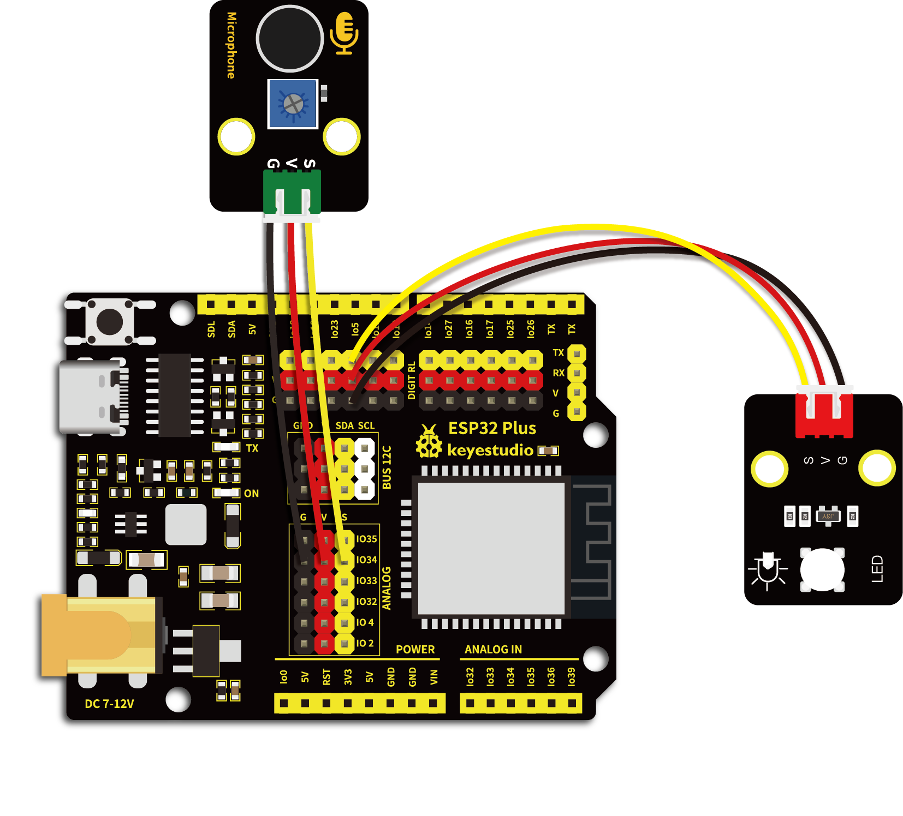

# 第五十二课 声控灯

## 1.1 项目介绍

如今智能家居发展迅速，你使用过智能家居当中的智能声控灯吗？当我们跺跺脚或者拍拍手时，智能声控灯自动亮起；当没有声音时，智能声控灯处于熄灭状态。智能声控灯上安装有声音探测传感器，这些传感器将外界声音的大小，转换成对应数值。智能声控灯设置一个临界点，当声音转换后对应的数值超过该临界点时，灯光亮起一段时间。

在这一实验课程中，我们将声音传感器和紫色LED模块组合实验，学习制作一个最简单的智能声控灯。

---

## 1.2 实验组件

|  |  |  |        |  |
| ------------------------ | ------------------------ | ------------------------ | ---------------------------- | --------------------- |
| ESP32 Plus主板 x1        | Keyes 声音传感器 x1      | Keyes 紫色LED模块 x1     | XH2.54-3P 转杜邦线母单线  x2 | USB线  x1             |

---

## 1.3 模块接线图



---

## 1.4 在线运行代码

打开Thonny并单击，然后单击“**此电脑**”。

选中“**D:\代码**”路径，打开代码文件''**lesson_52_sound_controlled_lights.py**"。

```python
from machine import ADC, Pin
import time
 
# 开启并配置ADC，量程为0-3.3V
adc=ADC(Pin(34))
adc.atten(ADC.ATTN_11DB)
adc.width(ADC.WIDTH_12BIT)

led = Pin(5,Pin.OUT)

while True: 
    adcVal=adc.read()
    if adcVal > 400:
        led.value(1)
        print(adcVal, "led on")
        time.sleep(3)
    else:
        led.value(0)
        print(adcVal, "led off")
        time.sleep(0.1)
```

---

## 1.5 实验结果

按照接线图正确接好模块，用USB线连接到计算机上电，单击来执行程序代码。代码开始执行，“Shell”窗口打印出声音传感器接收到的声音对应的ADC值，接收到的声音增大时ADC值也增大，当ADC值大于400时，LED模块上LED亮起3秒，然后熄灭。

单击或按Ctrl+C退出程序。


---

