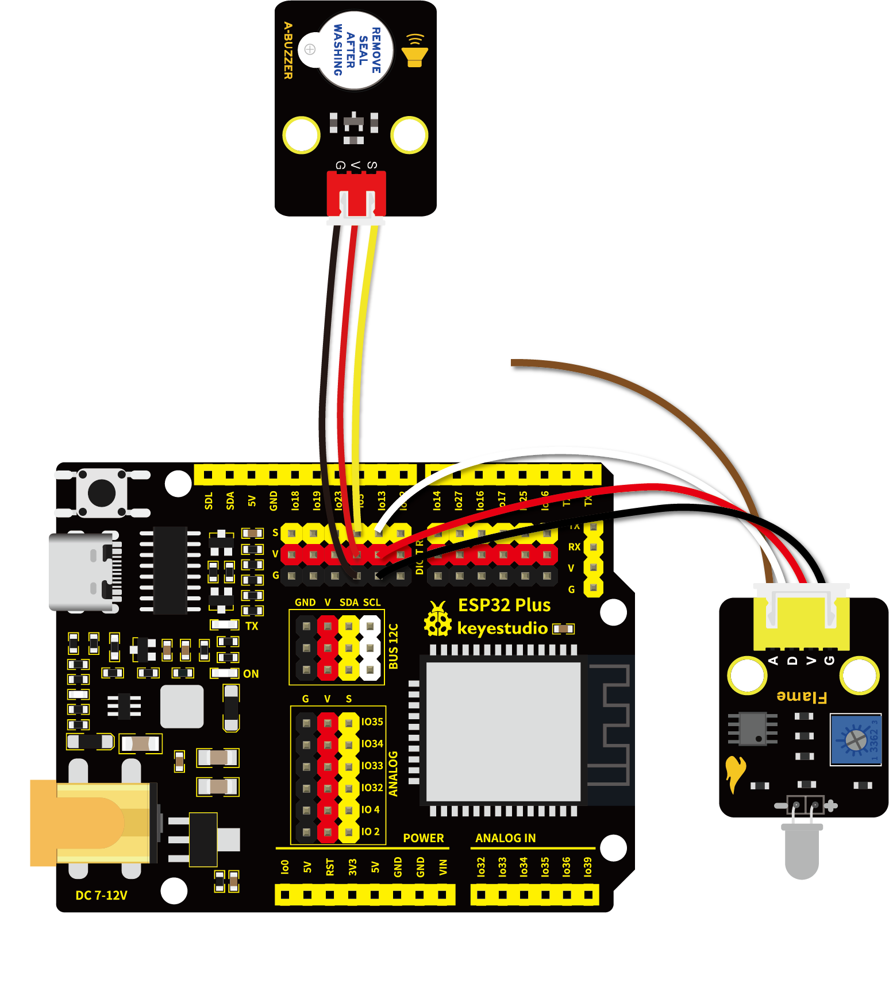

# 第五十三课 火焰报警

## 1.1 项目介绍

生活中，火灾的危害是相当大的。这一课我们来学习制作一个火灾报警系统，它虽然简单，但却是非常具有意义的。原理很简单，利用火焰传感器检测，检测的结果控制一个有源蜂鸣器响起。

---

## 1.2 实验组件

|      |      |  |
| ---------------------------- | ---------------------------- | ------------------------ |
| ESP32 Plus主板 x1            | Keyes 有源蜂鸣器模块 x1      | Keyes 火焰传感器 x1      |
|        |        |     |
| XH2.54-3P 转杜邦线母单线  x1 | XH2.54-4P 转杜邦线母单线  x1 | USB线  x1                |

---

## 1.3 模块接线图



---

## 1.4 在线运行代码

打开Thonny并单击，然后单击“**此电脑**”。

选中“**D:\代码**”路径，打开代码文件''**lesson_53_Flame_alarm.py**"。

```python
from machine import Pin
import time

buzzer = Pin(15, Pin.OUT)
sensor = Pin(4, Pin.IN)
 
while True:
    Val = sensor.value()
    print(Val)
    if Val == 0:
        buzzer.value(1)
    else:
        buzzer.value(0)
    time.sleep(0.5)
```

---

## 1.5 实验结果

按照接线图正确接好模块，用USB线连接到计算机上电，单击来执行程序代码。代码开始执行，此时火焰传感器上的红色LED2点亮。旋转火焰传感器上的电位器，微调使传感器上红色LED1灯介于亮与不亮之间的**不亮**状态。


当火焰传感器检测到火焰时，有源蜂鸣器响起，否则有源蜂鸣器不响。

---

## 1.6 代码说明

此课程代码与第四十三课代码类似，这里就不多做介绍了。  
