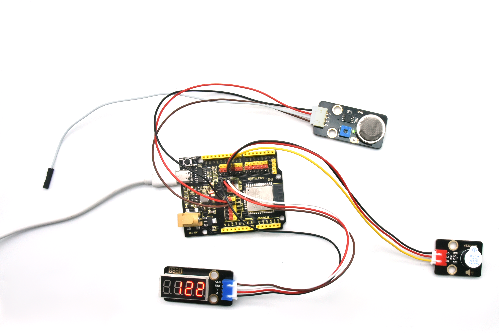

# 第五十四课 烟雾报警器

## 1.1 项目介绍

在前面课程中，我们学习了如何使用有源蜂鸣器模块、学习了如何使用MQ-2 烟雾传感器检测可燃气体、还学会了如何控制四位数码管显示数字或字符。这一课程，我们尝试着将这三个实验结合在一起，制作一个烟雾报警器。制作思路是通过烟雾传感器测试出可燃气体的浓度，然后利用检测结果控制有源蜂鸣器报警、四位数码管显示检测到的值。

---

## 1.2 实验组件

|      |      |  |  |
| ---------------------------- | ---------------------------- | ------------------------ | ------------------------ |
| ESP32 Plus主板 x1            | Keyes 有源蜂鸣器模块 x1      | Keyes 模拟气体传感器 x1  | Keyes 四位数码管模块 x1  |
|        |        |     |                          |
| XH2.54-3P 转杜邦线母单线  x1 | XH2.54-4P 转杜邦线母单线  x2 | USB线  x1                |                          |

---

## 1.3 模块接线图


---

## 1.4 在线运行代码

打开Thonny并单击，然后单击“**此电脑**”。

选中“**D:\代码**”路径，打开代码文件''**lesson_54_smoke_alarm.py**"。

```python
# 导入引脚和ADC模块
from machine import ADC,Pin
import time

# 开启并配置ADC，量程为0-3.3V
adc=ADC(Pin(34))
adc.atten(ADC.ATTN_11DB)
adc.width(ADC.WIDTH_12BIT)

buzzer = Pin(5, Pin.OUT)
# TM1650的定义
ADDR_DIS = 0x48  #加密模式命令
ADDR_KEY = 0x49  #读键值命令

# 亮度的定义
BRIGHT_DARKEST = 0
BRIGHT_TYPICAL = 2
BRIGHTEST      = 7

on  = 1
off = 0

# number:0~9
NUM = [0x3f,0x06,0x5b,0x4f,0x66,0x6d,0x7d,0x07,0x7f,0x6f] 
# DIG = [0x68,0x6a,0x6c,0x6e]
DIG = [0x6e,0x6c,0x6a,0x68]
DOT = [0,0,0,0]

clkPin = 22
dioPin = 21
clk = Pin(clkPin, Pin.OUT)
dio = Pin(dioPin, Pin.OUT)

DisplayCommand = 0

def writeByte(wr_data):
    global clk,dio
    for i in range(8):
        if(wr_data & 0x80 == 0x80):
            dio.value(1)
        else:
            dio.value(0)
        clk.value(0)
        time.sleep(0.0001)
        clk.value(1)
        time.sleep(0.0001)
        clk.value(0)
        wr_data <<= 1
    return

def start():
    global clk,dio
    dio.value(1)
    clk.value(1)
    time.sleep(0.0001)
    dio.value(0)
    return
    
def ack():
    global clk,dio
    dy = 0
    clk.value(0)
    time.sleep(0.0001)
    dio = Pin(dioPin, Pin.IN)
    while(dio.value() == 1):
        time.sleep(0.0001)
        dy += 1
        if(dy>5000):
            break
    clk.value(1)
    time.sleep(0.0001)
    clk.value(0)
    dio = Pin(dioPin, Pin.OUT)
    return
    
def stop():
    global clk,dio
    dio.value(0)
    clk.value(1)
    time.sleep(0.0001)
    dio.value(1)
    return
    
def displayBit(bit, num):
    global ADDR_DIS
    if(num > 9 and bit > 4):
        return
    start()
    writeByte(ADDR_DIS)
    ack()
    writeByte(DisplayCommand)
    ack()
    stop()
    start()
    writeByte(DIG[bit-1])
    ack()
    if(DOT[bit-1] == 1):
        writeByte(NUM[num] | 0x80)
    else:
        writeByte(NUM[num])
    ack()
    stop()
    return
    
def clearBit(bit):
    if(bit > 4):
        return
    start()
    writeByte(ADDR_DIS)
    ack()
    writeByte(DisplayCommand)
    ack()
    stop()
    start()
    writeByte(DIG[bit-1])
    ack()
    writeByte(0x00)
    ack()
    stop()
    return
    
    
def setBrightness(b = BRIGHT_TYPICAL):
    global DisplayCommand,brightness
    DisplayCommand = (DisplayCommand & 0x0f)+(b<<4)
    return

def setMode(segment = 0):
    global DisplayCommand
    DisplayCommand = (DisplayCommand & 0xf7)+(segment<<3)
    return
    
def displayOnOFF(OnOff = 1):
    global DisplayCommand
    DisplayCommand = (DisplayCommand & 0xfe)+OnOff
    return

def displayDot(bit, OnOff):
    if(bit > 4):
        return
    if(OnOff == 1): 
        DOT[bit-1] = 1;
    else:
        DOT[bit-1] = 0;
    return
        
def InitDigitalTube():
    setBrightness(2)
    setMode(0)
    displayOnOFF(1)
    for _ in range(4):
        clearBit(_)
    return

def ShowNum(num): #0~9999
    displayBit(1,num%10)
    if(num < 10):
        clearBit(2)
        clearBit(3)
        clearBit(4)
    if(num > 9 and num < 100):
        displayBit(2,num//10%10)
        clearBit(3)
        clearBit(4)
    if(num > 99 and num < 1000):
        displayBit(2,num//10%10)
        displayBit(3,num//100%10)
        clearBit(4)
    if(num > 999 and num < 10000):
        displayBit(2,num//10%10)
        displayBit(3,num//100%10)
        displayBit(4,num//1000)

InitDigitalTube()

while True:
    adcVal=adc.read()
    print(adcVal) 
    ShowNum(adcVal)
    if adcVal > 1000:
        buzzer.value(1)
    else:
        buzzer.value(0)
    time.sleep(0.1)
```

---

## 1.5 实验结果

按照接线图正确接好模块，用USB线连接到计算机上电，单击来执行程序代码。代码开始执行，当传感器检测到可燃气体浓度超标（ADC值大于1000)时，有源蜂鸣器模块发出警报，四位数码管显示浓度值。



---

## 1.6 代码说明

定义一个整数变量adcVal，用于存储传感器检测到烟雾的ADC值，最大为4095。然后将这个ADC值显示在四位数码管中，再设置一个阈值（阈值为1000，可以根据实际情况重新更改），达到这个阈值时有源蜂鸣器响起。  
