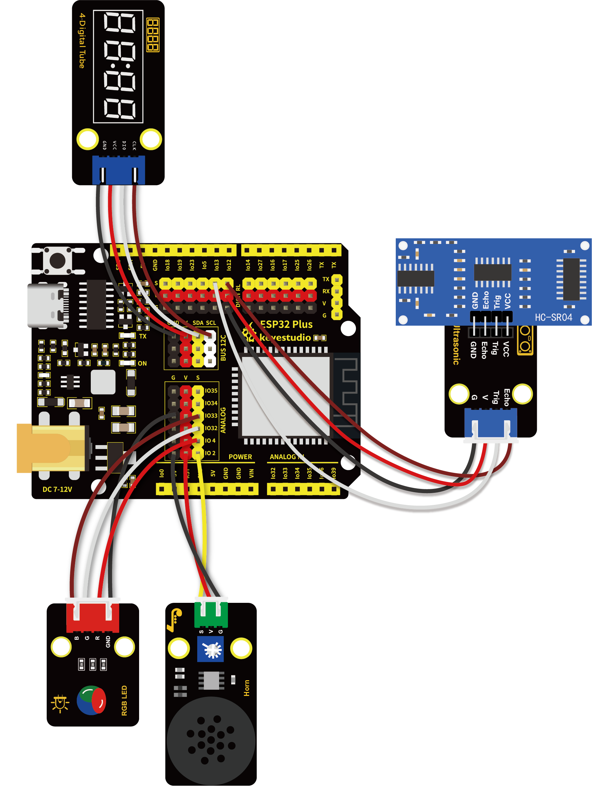

# 第五十六课 超声波雷达

## 1.1 项目介绍

蝙蝠飞行与获取猎物是通过回声定位的。回声定位：某些动物能通过口腔或鼻腔把从喉部产生的超声波发射出去，利用折回的声音来定向，这种空间定向的方法称为回声定位。科学家们从蝙蝠身上得到的启示发明了雷达，即雷达的天线相当于蝙蝠的嘴,而天线发出的无线电波就相当于蝙蝠的超声波,雷达接收电波的荧光屏就相当于蝙蝠的耳朵。

这一课我们就来学习制作一个简易雷达。将HC-SR04 超声波传感器、8002b功放 喇叭模块、共阴RGB模块和TM1650四位数码管模块组合实验，利用距离大小控制功放喇叭模块模块响起对应频率的声音、RGB亮起对应颜色，然后把这个距离显示在四位数码管上。这样就搭建好了一个简易的超声波雷达系统。

---

## 1.2 实验组件

|      |  |       |
| ---------------------------- | ---------------------------- | ----------------------------- |
| ESP32 Plus主板 x1            | HC-SR04 超声波传感器 x1      | Keyes 超声波转接模块 x1       |
|      |      |       |
| Keyes 8002b功放 喇叭模块 x1  | Keyes 共阴RGB模块 x1         | Keyes TM1650四位数码管模块 x1 |
|        |        |          |
| XH2.54-3P 转杜邦线母单线  x1 | XH2.54-4P 转杜邦线母单线  x3 | USB线  x1                     |

---

## 1.3 模块接线图



---

## 1.4 在线运行代码

打开Thonny并单击，然后单击“**此电脑**”。

选中“**D:\代码**”路径，打开代码文件''**lesson_56_Ultrasonic_radar.py**"。

```python
from machine import Pin, PWM
import utime
 
# TM1650的定义
ADDR_DIS = 0x48  #mode command
ADDR_KEY = 0x49  #read key value command

# 亮度的定义
BRIGHT_DARKEST = 0
BRIGHT_TYPICAL = 2
BRIGHTEST      = 7

on  = 1
off = 0

# number:0~9
NUM = [0x3f,0x06,0x5b,0x4f,0x66,0x6d,0x7d,0x07,0x7f,0x6f] 
DIG = [0x6e,0x6c,0x6a,0x68]
DOT = [0,0,0,0]

clkPin = 22
dioPin = 21
clk = Pin(clkPin, Pin.OUT)
dio = Pin(dioPin, Pin.OUT)

DisplayCommand = 0

def writeByte(wr_data):
    global clk,dio
    for i in range(8):
        if(wr_data & 0x80 == 0x80):
            dio.value(1)
        else:
            dio.value(0)
        clk.value(0)
        utime.sleep(0.0001)
        clk.value(1)
        utime.sleep(0.0001)
        clk.value(0)
        wr_data <<= 1
    return

def start():
    global clk,dio
    dio.value(1)
    clk.value(1)
    utime.sleep(0.0001)
    dio.value(0)
    return
    
def ack():
    global clk,dio
    dy = 0
    clk.value(0)
    utime.sleep(0.0001)
    dio = Pin(dioPin, Pin.IN)
    while(dio.value() == 1):
        utime.sleep(0.0001)
        dy += 1
        if(dy>5000):
            break
    clk.value(1)
    utime.sleep(0.0001)
    clk.value(0)
    dio = Pin(dioPin, Pin.OUT)
    return
    
def stop():
    global clk,dio
    dio.value(0)
    clk.value(1)
    utime.sleep(0.0001)
    dio.value(1)
    return
    
def displayBit(bit, num):
    global ADDR_DIS
    if(num > 9 and bit > 4):
        return
    start()
    writeByte(ADDR_DIS)
    ack()
    writeByte(DisplayCommand)
    ack()
    stop()
    start()
    writeByte(DIG[bit-1])
    ack()
    if(DOT[bit-1] == 1):
        writeByte(NUM[num] | 0x80)
    else:
        writeByte(NUM[num])
    ack()
    stop()
    return
    
def clearBit(bit):
    if(bit > 4):
        return
    start()
    writeByte(ADDR_DIS)
    ack()
    writeByte(DisplayCommand)
    ack()
    stop()
    start()
    writeByte(DIG[bit-1])
    ack()
    writeByte(0x00)
    ack()
    stop()
    return
    
    
def setBrightness(b = BRIGHT_TYPICAL):
    global DisplayCommand,brightness
    DisplayCommand = (DisplayCommand & 0x0f)+(b<<4)
    return

def setMode(segment = 0):
    global DisplayCommand
    DisplayCommand = (DisplayCommand & 0xf7)+(segment<<3)
    return
    
def displayOnOFF(OnOff = 1):
    global DisplayCommand
    DisplayCommand = (DisplayCommand & 0xfe)+OnOff
    return

def displayDot(bit, OnOff):
    if(bit > 4):
        return
    if(OnOff == 1): 
        DOT[bit-1] = 1;
    else:
        DOT[bit-1] = 0;
    return
        
def InitDigitalTube():
    setBrightness(2)
    setMode(0)
    displayOnOFF(1)
    for _ in range(4):
        clearBit(_)
    return

def ShowNum(num): #0~9999
    displayBit(1,num%10)
    if(num < 10):
        clearBit(2)
        clearBit(3)
        clearBit(4)
    if(num > 9 and num < 100):
        displayBit(2,num//10%10)
        clearBit(3)
        clearBit(4)
    if(num > 99 and num < 1000):
        displayBit(2,num//10%10)
        displayBit(3,num//100%10)
        clearBit(4)
    if(num > 999 and num < 10000):
        displayBit(2,num//10%10)
        displayBit(3,num//100%10)
        displayBit(4,num//1000)

pwm_r = PWM(Pin(4)) 
pwm_g = PWM(Pin(32))
pwm_b = PWM(Pin(33))

pwm_r.freq(1000)
pwm_g.freq(1000)
pwm_b.freq(1000)

def light(red, green, blue):
    pwm_r.duty(red)
    pwm_g.duty(green)
    pwm_b.duty(blue)

#超声波测距，单位:厘米
def getDistance(trigger, echo):
    # 产生10us方波
    trigger.value(0)   #事先给一个短的低电平，以确保一个干净的高脉冲;
    utime.sleep_us(2)
    trigger.value(1)
    utime.sleep_us(10)#拉高后，等待10微秒，立即调低
    trigger.value(0)
    
    while echo.value() == 0: #建立while循环，检测回波引脚值是否为0，并记录此时的时间
        start = utime.ticks_us()
    while echo.value() == 1: #建立while循环，检查回波引脚值是否为1，并记录此时的时间
        end = utime.ticks_us()
    d = (end - start) * 0.0343 / 2 #声波的传播时间x声速(343.2 m/s, 0.0343 cm/微秒)，再除以来回距离2
    return d

# 设置引脚
trigger = Pin(13, Pin.OUT)
echo = Pin(12, Pin.IN)

buzzer = PWM(Pin(2))
def playtone(frequency):
    buzzer.duty(1000)
    buzzer.freq(frequency)

def bequiet():
    buzzer.duty(0)
    
# 主程序
InitDigitalTube()
while True:
    distance = int(getDistance(trigger, echo))
    ShowNum(distance)
    if distance <= 10:
        playtone(880)
        utime.sleep(0.1)
        bequiet() 
        light(1023, 0, 0)
    elif distance <= 20:
        playtone(532)
        utime.sleep(0.2)
        bequiet()
        light(0, 0, 1023)
    else:
        light(0, 1023, 0)
```

---

## 1.5 实验结果

按照接线图正确接好模块，用USB线连接到计算机上电，单击来执行程序代码。代码开始执行，当超声波传感器检测到障碍物距离范围在10cm 以内时，RGB LED灯亮红色，并将检测到障碍物的距离显示在四位数码管上。同时8002b功放 喇叭模块发出频率较快的声响，起到提示的作用。


当超声波传感器检测到障碍物距离范围在10cm ~ 20cm 以内时，RGB LED灯亮绿色，并将检测到障碍物的距离显示在四位数码管上。同时8002b功放 喇叭模块发出声响，起到提示的作用。


当超声波传感器检测到障碍物距离范围在20cm 以外时，RGB LED灯亮蓝色，并将检测到障碍物的距离显示在四位数码管上。


---

