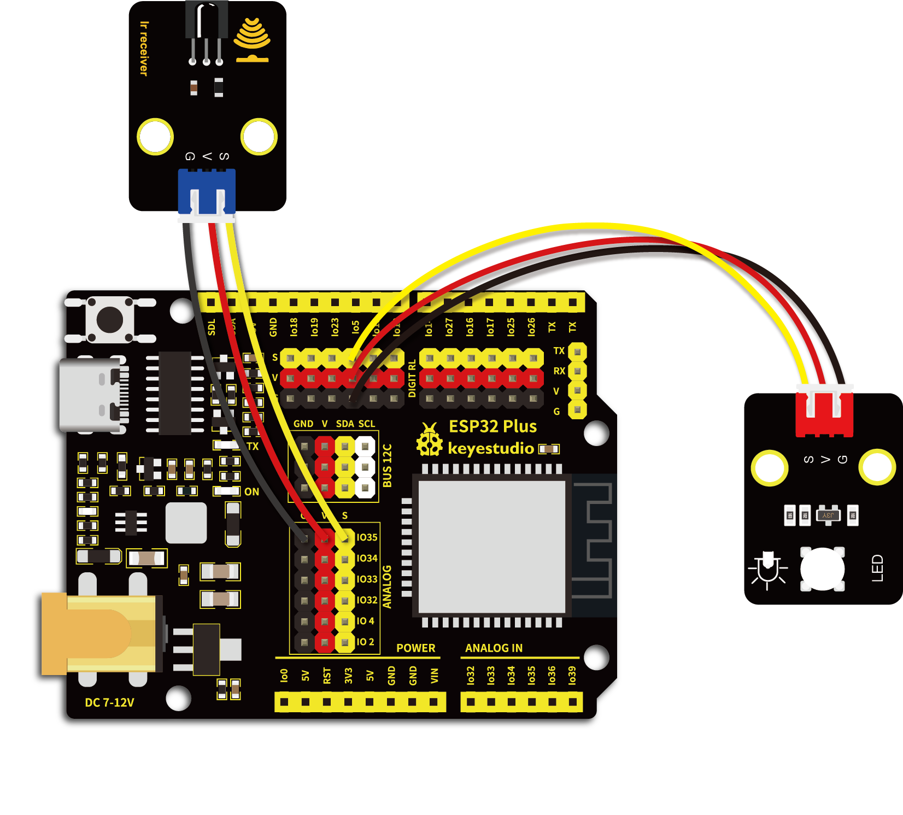

# 第五十七课 红外遥控灯

## 1.1 项目介绍

在前面实验中，我们学会了点亮或熄灭LED、学会了利用PWM调节灯光的亮度、学会了使用红外接收模块，并将接收到的遥控器对应的键值打印出来。在这一实验课程中，我们将红外接收模块和紫色LED模块组合实验，实现用红外遥控器控制紫色LED的亮灭以及控制紫色LED显示不同亮度。

当红外接收模块接收到红外遥控器的按键值时，通过设置此按键值的输出PWM值实现设置不同LED亮度的效果，控制LED的亮灭也一样。

在这一实验课程中我们使用 “①“、”②“、”③”三个按键来控制紫色LED实现弱亮、正常亮、强亮三种不同亮度。如果想要使用 “OK” 键这一个按键来控制LED亮和灭的两种情况该如何实现呢？这一实验课程我们将学习使用一个新的基本数据类型 —— boolean，来实现同一个按键控制LED亮灭的效果。

**boolean 数据类型**，变量存储为 8位（1 个字节）的数值形式，**只能是 True 或是 False**。boolean 变量的值显示为 True 或 False（在使用 Print 的时候），或者 #TRUE# 或 #FALSE#（在使用 Write # 的时候）。使用关键字True 与 False 可将 boolean 变量赋值为这两个状态中的一个。

设置代码，按下“OK”键且满足某一条件，点亮LED；按下“OK”键且满足另一条件，熄灭LED。这个条件我们用 boolean 来实现是最简单方便的，因为 boolean 只有 True 或是 False 两种状态。我们只需要设置按下“OK”键的同时 flag 为 true，即可点亮LED；同理按下“OK”键的同时 flag 为 false，熄灭LED。

---

## 1.2 实验组件

|          |      |  |
| -------------------------------- | ---------------------------- | ------------------------ |
| ESP32 Plus主板 x1                | Keyes 红外接收模块 x1        | Keyes 紫色LED模块 x1     |
|  |        |     |
| Keyes 遥控器 x1                  | XH2.54-3P 转杜邦线母单线  x2 | USB线  x1                |

---

## 1.3 模块接线图



---

## 1.4 在线运行代码

打开Thonny并单击，然后单击“**此电脑**”。

选中“**D:\代码**”路径，打开代码文件''**lesson_57_IR_control_LED.py**"。

```python
import time
from machine import Pin

led = Pin(5, Pin.OUT)
ird = Pin(35,Pin.IN)

act = {"1": "LLLLLLLLHHHHHHHHLHHLHLLLHLLHLHHH","2": "LLLLLLLLHHHHHHHHHLLHHLLLLHHLLHHH","3": "LLLLLLLLHHHHHHHHHLHHLLLLLHLLHHHH",
       "4": "LLLLLLLLHHHHHHHHLLHHLLLLHHLLHHHH","5": "LLLLLLLLHHHHHHHHLLLHHLLLHHHLLHHH","6": "LLLLLLLLHHHHHHHHLHHHHLHLHLLLLHLH",
       "7": "LLLLLLLLHHHHHHHHLLLHLLLLHHHLHHHH","8": "LLLLLLLLHHHHHHHHLLHHHLLLHHLLLHHH","9": "LLLLLLLLHHHHHHHHLHLHHLHLHLHLLHLH",
       "0": "LLLLLLLLHHHHHHHHLHLLHLHLHLHHLHLH","Up": "LLLLLLLLHHHHHHHHLHHLLLHLHLLHHHLH","Down": "LLLLLLLLHHHHHHHHHLHLHLLLLHLHLHHH",
       "Left": "LLLLLLLLHHHHHHHHLLHLLLHLHHLHHHLH","Right": "LLLLLLLLHHHHHHHHHHLLLLHLLLHHHHLH","Ok": "LLLLLLLLHHHHHHHHLLLLLLHLHHHHHHLH",
       "*": "LLLLLLLLHHHHHHHHLHLLLLHLHLHHHHLH","#": "LLLLLLLLHHHHHHHHLHLHLLHLHLHLHHLH"}

def read_ircode(ird):
    wait = 1
    complete = 0
    seq0 = []
    seq1 = []

    while wait == 1:
        if ird.value() == 0:
            wait = 0
    while wait == 0 and complete == 0:
        start = time.ticks_us()
        while ird.value() == 0:
            ms1 = time.ticks_us()
        diff = time.ticks_diff(ms1,start)
        seq0.append(diff)
        while ird.value() == 1 and complete == 0:
            ms2 = time.ticks_us()
            diff = time.ticks_diff(ms2,ms1)
            if diff > 10000:
                complete = 1
        seq1.append(diff)

    code = ""
    for val in seq1:
        if val < 2000:
            if val < 700:
                code += "L"
            else:
                code += "H"
    # print(code)
    command = ""
    for k,v in act.items():
        if code == v:
            command = k
    if command == "":
        command = code
    return command

flag = False
while True:
#     global flag
    command = read_ircode(ird)
    print(command, end = "  ")
    print(flag, end = "  ")
    if command == "Ok":
        if flag == True:
            led.value(1)
            flag = False
            print("led on") 
        else:
            led.value(0)
            flag = True
            print("led off")
    time.sleep(0.1)
```

---

## 1.5 实验结果

按照接线图正确接好模块，用USB线连接到计算机上电，单击来执行程序代码。代码开始执行。第一次按下红外遥控器上的 “**OK**” 键，此时的布尔变量“**flag**”为真，紫色LED被点亮，实现开灯的效果。“Shell”窗口打印出“**OK True led on**” 。点亮后布尔变量“**flag**”又被设置为假。

再次按下红外遥控器上的 “**OK**” 键，布尔变量“**flag**”在LED点亮后被设置为假，紫色LED熄灭，实现关灯的效果。“Shell”窗口打印出“**OK False led off**” 。


---

