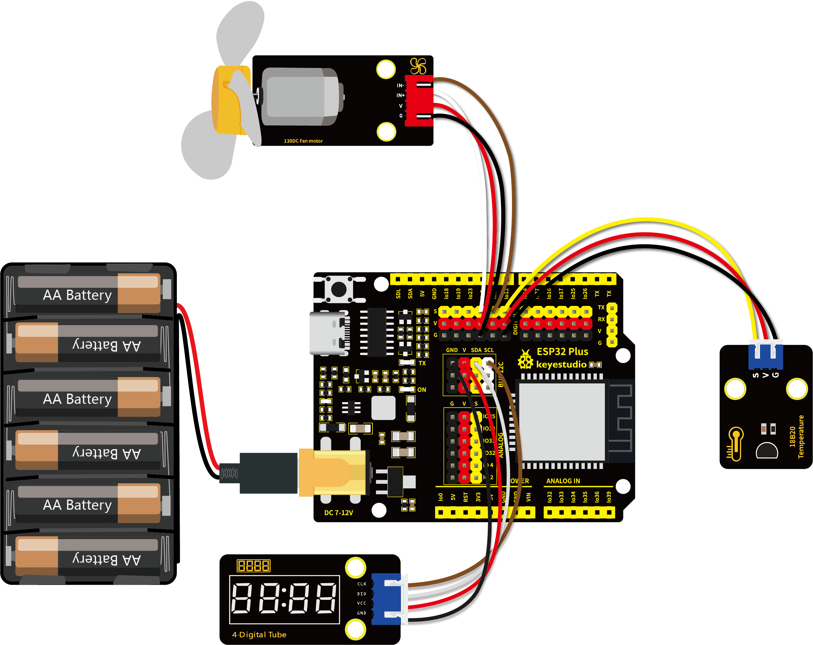
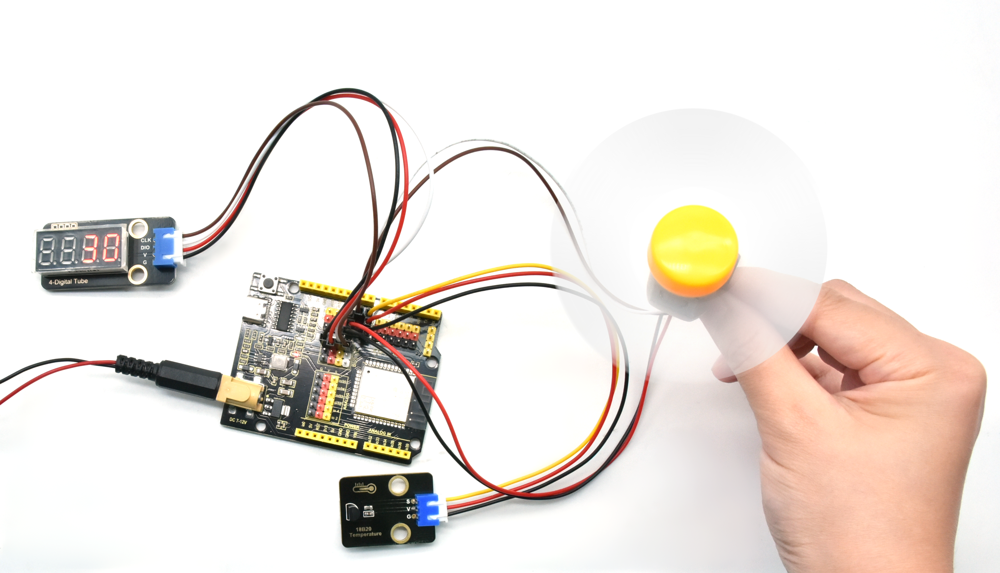

# 第五十八课 模拟温度散热装置

## 1.1 项目介绍

生活中，我们的电脑或者电路板芯片等器件会由于工作时间过长或者功耗过大的问题而发热严重，所以我们常常需要一个散热装置。

在前面的课程我们学习了如何使用温度传感器和电机模块，这一课我们学习把它们结合起来做成一个智能散热装置。当检测到环境温度高于某一个值时的时候，电机开启，从而达到降低环境温度、散热效果。再把此刻的温度值显示在四位数码管中。

---

## 1.2 实验组件

|  |      |       |
| ------------------------ | ---------------------------- | ----------------------------- |
| ESP32 Plus主板 x1        | Keyes 130电机模块 x1         | Keyes TM1650四位数码管模块 x1 |
|  |        |         |
| Keyes 18B20温度传感器 x1 | XH2.54-3P 转杜邦线母单线  x1 | XH2.54-4P 转杜邦线母单线  x2  |
|     |         |               |
| USB线  x1                | 6节5号电池盒  x1             | 5号电池**(自备)**  x6         |

---

## 1.3 模块接线图



---

## 1.4 在线运行代码

打开Thonny并单击，然后单击“**此电脑**”。

选中“**D:\代码**”路径，打开代码文件''**lesson_58_heat_abstractor.py**"。

**<span style="background:#ff0;color:#000">注意：在上传代码前先接好模块，否则代码可能上传不成功。</span>**

**若上传不成功，请查看是否添加了库。**

```python
from machine import Pin
import machine, onewire, ds18x20, time

ds_pin = machine.Pin(12)

ds_sensor = ds18x20.DS18X20(onewire.OneWire(ds_pin))

roms = ds_sensor.scan()

#电机的两个引脚
INA = Pin(5, Pin.OUT) #INA对应IN+
INB = Pin(13, Pin.OUT)#INB对应IN-
# TM1650的定义
ADDR_DIS = 0x48  #加密模式命令
ADDR_KEY = 0x49  #读键值命令

# 亮度的定义
BRIGHT_DARKEST = 0
BRIGHT_TYPICAL = 2
BRIGHTEST      = 7

on  = 1
off = 0

# number:0~9
NUM = [0x3f,0x06,0x5b,0x4f,0x66,0x6d,0x7d,0x07,0x7f,0x6f] 
# DIG = [0x68,0x6a,0x6c,0x6e]
DIG = [0x6e,0x6c,0x6a,0x68]
DOT = [0,0,0,0]

clkPin = 22
dioPin = 21
clk = Pin(clkPin, Pin.OUT)
dio = Pin(dioPin, Pin.OUT)

DisplayCommand = 0

def writeByte(wr_data):
    global clk,dio
    for i in range(8):
        if(wr_data & 0x80 == 0x80):
            dio.value(1)
        else:
            dio.value(0)
        clk.value(0)
        time.sleep(0.0001)
        clk.value(1)
        time.sleep(0.0001)
        clk.value(0)
        wr_data <<= 1
    return

def start():
    global clk,dio
    dio.value(1)
    clk.value(1)
    time.sleep(0.0001)
    dio.value(0)
    return
    
def ack():
    global clk,dio
    dy = 0
    clk.value(0)
    time.sleep(0.0001)
    dio = Pin(dioPin, Pin.IN)
    while(dio.value() == 1):
        time.sleep(0.0001)
        dy += 1
        if(dy>5000):
            break
    clk.value(1)
    time.sleep(0.0001)
    clk.value(0)
    dio = Pin(dioPin, Pin.OUT)
    return
    
def stop():
    global clk,dio
    dio.value(0)
    clk.value(1)
    time.sleep(0.0001)
    dio.value(1)
    return
    
def displayBit(bit, num):
    global ADDR_DIS
    if(num > 9 and bit > 4):
        return
    start()
    writeByte(ADDR_DIS)
    ack()
    writeByte(DisplayCommand)
    ack()
    stop()
    start()
    writeByte(DIG[bit-1])
    ack()
    if(DOT[bit-1] == 1):
        writeByte(NUM[num] | 0x80)
    else:
        writeByte(NUM[num])
    ack()
    stop()
    return
    
def clearBit(bit):
    if(bit > 4):
        return
    start()
    writeByte(ADDR_DIS)
    ack()
    writeByte(DisplayCommand)
    ack()
    stop()
    start()
    writeByte(DIG[bit-1])
    ack()
    writeByte(0x00)
    ack()
    stop()
    return
    
    
def setBrightness(b = BRIGHT_TYPICAL):
    global DisplayCommand,brightness
    DisplayCommand = (DisplayCommand & 0x0f)+(b<<4)
    return

def setMode(segment = 0):
    global DisplayCommand
    DisplayCommand = (DisplayCommand & 0xf7)+(segment<<3)
    return
    
def displayOnOFF(OnOff = 1):
    global DisplayCommand
    DisplayCommand = (DisplayCommand & 0xfe)+OnOff
    return

def displayDot(bit, OnOff):
    if(bit > 4):
        return
    if(OnOff == 1): 
        DOT[bit-1] = 1;
    else:
        DOT[bit-1] = 0;
    return
        
def InitDigitalTube():
    setBrightness(2)
    setMode(0)
    displayOnOFF(1)
    for _ in range(4):
        clearBit(_)
    return

def ShowNum(num): #0~9999
    displayBit(1,num%10)
    if(num < 10):
        clearBit(2)
        clearBit(3)
        clearBit(4)
    if(num > 9 and num < 100):
        displayBit(2,num//10%10)
        clearBit(3)
        clearBit(4)
    if(num > 99 and num < 1000):
        displayBit(2,num//10%10)
        displayBit(3,num//100%10)
        clearBit(4)
    if(num > 999 and num < 10000):
        displayBit(2,num//10%10)
        displayBit(3,num//100%10)
        displayBit(4,num//1000)

InitDigitalTube()
print('Found DS devices: ', roms)

while True:
    ds_sensor.convert_temp()
    time.sleep_ms(750)
    for rom in roms:
        value = ds_sensor.read_temp(rom)
        print(value)
        ShowNum(int(value))
        if value > 30:
            INA.value(0)
            INB.value(1)
        else:
            INA.value(0)
            INB.value(0)
```

---

## 1.5 实验结果

按照接线图正确接好模块，接好电池盒，用USB线连接到计算机上电，单击来执行程序代码。代码开始执行，可以在四位数码管模块上看到当前温度值，当温度超过代码中设定的30°C时，风扇转动，散热。



---

## 1.6 代码说明

变量的设置与存储检测值，与前面我们学习的一样，也是通过设置一个温度的阈值（阈值30可以根据实际情况重新更改），超过这个阈值进行控制电机转动，四位数码管显示温度值。
