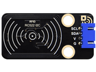

# 第五十九课 智能门禁系统

## 1.1 项目介绍

生活中，很多门禁系统都是使用射频模块进行开锁的，既方便又安全。这一课，学习利用RFID522刷卡模块和舵机设置一个智能门禁系统。

原理很简单，使用RFID522刷卡模块感应，使用IC卡或者钥匙卡来开锁，舵机的作用即门禁锁。

---

## 1.2 实验组件

|  |  |      |  |
| ------------------------ | ------------------------ | ---------------------------- | --------------------- |
| ESP32 Plus主板 x1        | Keyes RFID刷卡模块 x1    | 钥匙扣 x1                    | USB线  x1             |
|       |         |        |                       |
| IC卡  x1                 | 9G 180度数字舵机 x1      | XH2.54-4P 转杜邦线母单线  x1 |                       |

---

## 1.3 模块接线图


---

## 1.4 实验代码

打开Thonny并单击，然后单击“**此电脑**”。

选中“**D:\代码**”路径，打开代码文件''**lesson_59_Intelligent_access_contro.py**"。

**若上传不成功，请查看是否添加了库。**

**<span style="background:#ff0;color:#000">特别注意：对于不同的IC卡和钥匙扣，其读取的IC卡和钥匙扣的UID码值可能都不一样。在代码运行前，需要将你自己的IC卡和钥匙扣的UID码值替换程序代码中的UID码（UID码在第44课完成实验可以得知），替换位置如下图所示。</span>**


```python
from machine import Pin, PWM
import time
from mfrc522_i2c import mfrc522

pwm = PWM(Pin(4))
pwm.freq(50)

'''
占空比对应的角度
0°----2.5%----25
45°----5%----51.2
90°----7.5%----77
135°----10%----102.4
180°----12.5%----128
'''
angle_0 = 25
angle_90 = 77
angle_180 = 128

#i2c配置
addr = 0x28
scl = 22
sda = 21
    
rc522 = mfrc522(scl, sda, addr)
rc522.PCD_Init()
rc522.ShowReaderDetails()           # 显示PCD - MFRC522读卡器的详细信息

uid1 = [190, 80, 250, 111] 
uid2 = [251, 133, 131, 114]

pwm.duty(angle_180)
time.sleep(1)

while True:
    if rc522.PICC_IsNewCardPresent():
        if rc522.PICC_ReadCardSerial() == True:
            print("\nopen the door!")
            print("Card UID:", end=' ')
            print(rc522.uid.uidByte[0 : rc522.uid.size])
            if rc522.uid.uidByte[0 : rc522.uid.size] == uid1 or rc522.uid.uidByte[0 : rc522.uid.size] == uid2:
                pwm.duty(angle_0)
            else :
                pwm.duty(angle_180)
            time.sleep(500)
```

---

## 1.5 实验结果

按照接线图正确接好模块，用USB线连接到计算机上电，单击来执行程序代码。代码开始执行，使用正确的IC卡或者钥匙扣刷卡时，"Shell"窗口打印出“**open the door!**”和卡或钥匙扣的UID码，同时舵机转动到相应的角度模拟开门的效果。


---

## 1.6 代码说明

在前面的课程中，使用RFID刷卡模块已经测试出来了IC卡和钥匙扣的UID码。这一课利用对应的UID码信息来控制舵机转动对应的角度，模拟开门的效果。
