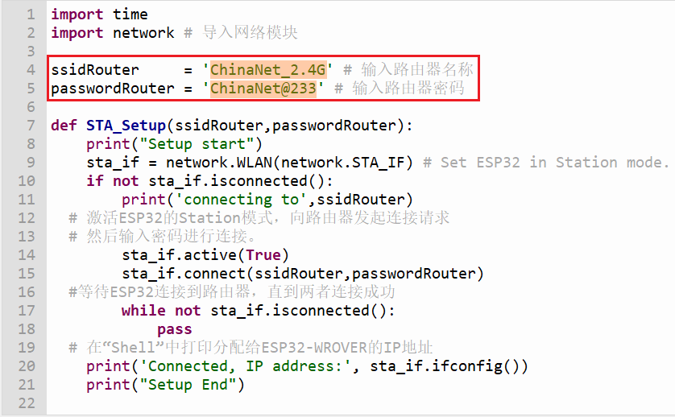
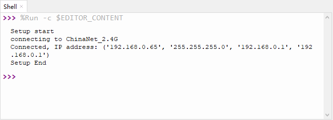

# 第六十课 WiFi Station Mode

## 1.1 项目介绍

ESP32有3种不同的WiFi工作模式：

- Station模式（作为WiFi设备主动连接路由器，也叫做WiFi Client）
- AP模式（作为一个Access Point，让其他WiFi设备来连接）即WiFi热点
- Station+AP共存模式（ESP32连接路由器的同时自身也是一个热点供其他WiFi设备来连接）

所有WiFi编程项目在使用WiFi前必须配置WiFi运行模式，否则无法使用WiFi。在这节实验课程中，我们将学习使用ESP32的WiFi Station模式。

**Station 模式：**

当ESP32选择Station模式时，它作为一个WiFi客户端。它可以连接路由器网络，通过WiFi连接与路由器上的其他设备通信。如下图所示，PC和路由器已经连接，ESP32如果要与PC通信，需要将PC和路由器连接起来。


---

## 1.2 实验组件

|  |  |
| ------------------------ | --------------------- |
| ESP32 Plus主板 x1        | USB线  x1             |

---

## 1.3 模块接线图


---

## 1.4 在线运行代码

打开Thonny并单击，然后单击“**此电脑**”。

选中“**D:\代码**”路径，打开代码文件''**lesson_60_WiFi_Station_Mode.py**"。

路由器的SSID是无线网的无线名称。SSID是 ServiceSetldentifier 的缩写，意思是:服务集标识。SSID技术可以将一个无线局域网分为几个需要不同身份验证的子网络，每一个子网络都需要独立的身份验证，只有通过身份验证的用户才可以进入相应的子网络，防止未被授权的用户进入本网络。所以在代码运行之前，需要配置 WiFi 名称和密码，将其修改为你自己使用的WiFi 名称和密码，如下图所示。



```python
import time
import network # 导入网络模块

ssidRouter     = 'ChinaNet_2.4G' # 输入路由器名称
passwordRouter = 'ChinaNet@233' # 输入路由器密码

def STA_Setup(ssidRouter,passwordRouter):
    print("Setup start")
    sta_if = network.WLAN(network.STA_IF) # Set ESP32 in Station mode.
    if not sta_if.isconnected():
        print('connecting to',ssidRouter)
  # 激活ESP32的Station模式，向路由器发起连接请求
  # 然后输入密码进行连接。   
        sta_if.active(True)
        sta_if.connect(ssidRouter,passwordRouter)
  #等待ESP32连接到路由器，直到两者连接成功    
        while not sta_if.isconnected():
            pass
  # 在“Shell”中打印分配给ESP32-WROVER的IP地址
    print('Connected, IP address:', sta_if.ifconfig())
    print("Setup End")

try:
    STA_Setup(ssidRouter,passwordRouter)
except:
    sta_if.disconnect()
```

---

## 1.5 实验结果

按照接线图正确接好模块，用USB线连接到计算机上电，单击来执行程序代码。代码开始执行，开始连接，当ESP32成功连接到路由器的 SSID 时，“Shell”窗口将打印出路由器分配给ESP32的**IP地址**。



**注意：如果打开串口监视器且设置好波特率，串口监视器窗口还是没有显示任何信息，可以尝试按下ESP32的RESET按键。**


---

