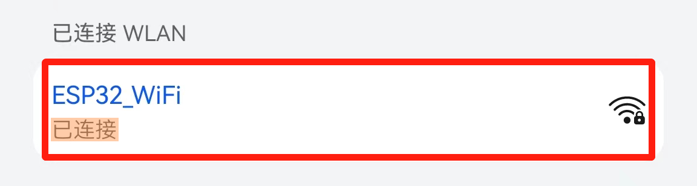

# 第六十一课 WiFi AP Mode

## 1.1 项目介绍

从上一课实验中我们知道ESP32有3种不同的WiFi工作模式：

- Station模式（作为WiFi设备主动连接路由器，也叫做WiFi Client）
- AP模式（作为一个Access Point，让其他WiFi设备来连接）即WiFi热点
- Station+AP共存模式（ESP32连接路由器的同时自身也是一个热点供其他WiFi设备来连接）

所有WiFi编程项目在使用WiFi前必须配置WiFi运行模式，否则无法使用WiFi。在这节实验课程中，我们将接着学习使用ESP32的WiFi AP模式。

**AP模式：**

接入点Access Point（AP）是一种提供 Wi-Fi 网络访问的设备，并将其连接到有线网络的装置。ESP32除了不具有与有线网络的接口外，还可以提供类似的功能。这种操作模式称为软接入点（soft-AP）。可以同时连接到soft-AP的最大站数可以设置4，默认为4。

当ESP32单独处于AP模式下时，可以被认为是一个无法访问外网的局域网WiFi路由器节点，它可以接受各类设备的连接请求。并可以和连接设备进行TCP、UDP连接，实现数据流。在局域物联网的设计中可以承担数据收发节点的作用。如下图所示，以ESP32为热点。如果手机或PC需要与ESP32通信，则必须连接到ESP32的热点。只有通过与ESP32建立连接后才能进行通信。


---

## 1.2 实验组件

|  |  |
| ------------------------ | --------------------- |
| ESP32 Plus主板 x1        | USB线  x1             |

---

## 1.3 模块接线图


---

## 1.4 在线运行代码

打开Thonny并单击，然后单击“**此电脑**”。

选中“**D:\代码**”路径，打开代码文件''**lesson_61_WiFi_AP_Mode.py**"。

在代码运行之前，需要配置ESP32的 AP名称和连接密码，如下图所示。当然，你也可以不修改它，使用默认的名称和连接密码。


```python
import network #导入网络模块

#请输入正确的路由器名称和密码
ssidAP         = 'ESP32_WiFi' #输入路由器名称
passwordAP     = '12345678'  #输入路由器密码

local_IP       = '192.168.1.108'
gateway        = '192.168.1.1'
subnet         = '255.255.255.0'
dns            = '8.8.8.8'

#设置ESP32为AP模式
ap_if = network.WLAN(network.AP_IF)

def AP_Setup(ssidAP,passwordAP):
    ap_if.ifconfig([local_IP,gateway,subnet,dns])
    print("Setting soft-AP  ... ")
    ap_if.config(essid=ssidAP,authmode=network.AUTH_WPA_WPA2_PSK, password=passwordAP)
    ap_if.active(True)
    print('Success, IP address:', ap_if.ifconfig())
    print("Setup End\n")

try:
    AP_Setup(ssidAP,passwordAP)
except:
    print("Failed, please disconnect the power and restart the operation.")
    ap_if.disconnect()
```

---

## 1.5 实验结果

按照接线图正确接好模块，用USB线连接到计算机上电，单击来执行程序代码。代码开始执行，打开ESP32的AP功能，“Shell”窗口中打印接入点信息。


**注意：如果打开串口监视器且设置好波特率，串口监视器窗口还是没有显示任何信息，可以尝试按下ESP32的RESET按键。**


打开手机的 WiFi 扫描功能，可以看到ESP32的 SSID ，在本课程代码中的名称为 “**ESP32_WiFi**” 。


你可以输入密码 “**12345678**” 连接它，也可以通过修改程序代码来修改它的AP名称和密码。



---

