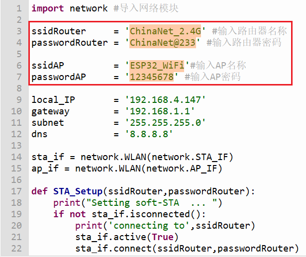
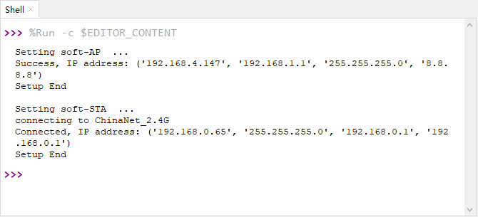
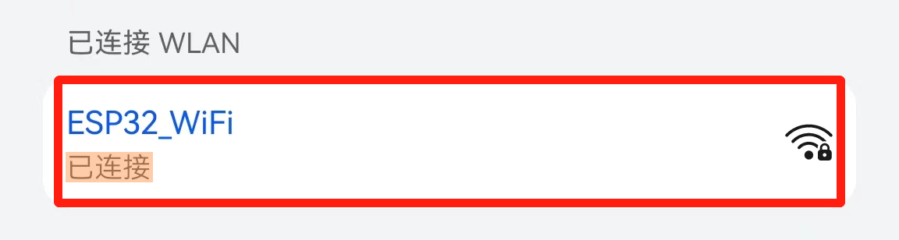

# 第六十二课 WiFi Station+AP Mode

## 1.1 项目介绍

从第六十课实验中我们知道ESP32有3种不同的WiFi工作模式：

- Station模式（作为WiFi设备主动连接路由器，也叫做WiFi Client）
- AP模式（作为一个Access Point，让其他WiFi设备来连接）即WiFi热点
- Station+AP共存模式（ESP32连接路由器的同时自身也是一个热点供其他WiFi设备来连接）

所有WiFi编程项目在使用WiFi前必须配置WiFi运行模式，否则无法使用WiFi。在这节实验课程中，我们将接着学习使用ESP32的WiFi Station+AP模式。

**AP+Station模式：**

ESP32除AP模式和Station模式外，还可以同时使用AP模式和Station模式。此模式包含前两种模式的功能。打开ESP32的Station模式，将其连接到路由器网络，它可以通过路由器与Internet通信。同时开启其AP模式，创建热点网络。其他WiFi设备可以选择连接路由器网络或热点网络与ESP32通信。

---

## 1.2 实验组件

|  |  |
| ------------------------ | --------------------- |
| ESP32 Plus主板 x1        | USB线  x1             |

---

## 1.3 模块接线图


---

## 1.4 在线运行代码

打开Thonny并单击，然后单击“**此电脑**”。

选中“**D:\代码**”路径，打开代码文件''**lesson_62_WiFi_Station+AP_Mode.py**"。

在代码运行之前，需要配置 WiFi 名称和密码、ESP32的 AP名称和连接密码，如下图所示。



```python
import network #导入网络模块

ssidRouter     = 'ChinaNet_2.4G' #输入路由器名称
passwordRouter = 'ChinaNet@233' #输入路由器密码

ssidAP         = 'ESP32_WiFi'#输入AP名称
passwordAP     = '12345678' #输入AP密码

local_IP       = '192.168.4.147'
gateway        = '192.168.1.1'
subnet         = '255.255.255.0'
dns            = '8.8.8.8'

sta_if = network.WLAN(network.STA_IF)
ap_if = network.WLAN(network.AP_IF)
    
def STA_Setup(ssidRouter,passwordRouter):
    print("Setting soft-STA  ... ")
    if not sta_if.isconnected():
        print('connecting to',ssidRouter)
        sta_if.active(True)
        sta_if.connect(ssidRouter,passwordRouter)
        while not sta_if.isconnected():
            pass
    print('Connected, IP address:', sta_if.ifconfig())
    print("Setup End")
    
def AP_Setup(ssidAP,passwordAP):
    ap_if.ifconfig([local_IP,gateway,subnet,dns])
    print("Setting soft-AP  ... ")
    ap_if.config(essid=ssidAP,authmode=network.AUTH_WPA_WPA2_PSK, password=passwordAP)
    ap_if.active(True)
    print('Success, IP address:', ap_if.ifconfig())
    print("Setup End\n")

try:
    AP_Setup(ssidAP,passwordAP)    
    STA_Setup(ssidRouter,passwordRouter)
except:
    sta_if.disconnect()
    ap_if.idsconnect()
```

---

## 1.5 实验结果

按照接线图正确接好模块，用USB线连接到计算机上电，单击来执行程序代码。代码开始执行，开始连接，“Shell”窗口中将显示如下：



**注意：如果打开串口监视器且设置好波特率，串口监视器窗口还是没有显示任何信息，可以尝试按下ESP32的RESET按键。**


打开手机 WiFi 扫描功能，可以看到ESP32的SSID，名称为 “**ESP32_WiFi**” 。



---


