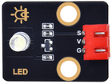
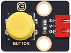
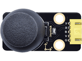

# 第六十三课 综合实验

## 1.1 项目介绍

我们已经学习了所有的模块和传感器的使用方法，也学习了将它们搭配在一起组合实验。在这一实验课程中我们将搭配更多的模块和传感器组合在一起。参考前面实验编程的方法，利用按键模块，实现每按一次按键，功能就变换一次的效果。

实验多种多样，大家可以发挥想象力，搭配模块和传感器做出更多具有意义的实验。

---

## 1.2 实验组件

|      |  |      |      |
| ---------------------------- | ------------------------ | ---------------------------- | ---------------------------- |
| ESP32 Plus主板 x1            | Keyes 紫色LED模块 x1     | Keyes 单路按键模块 x1        | Keyes 旋转电位器模块 x1      |
|      |  |  |      |
| Keyes 避障传感器 x1          | Keyes 摇杆模块 x1        | HC-SR04 超声波传感器 x1      | Keyes 超声波转接模块 x1      |
|      |     |        |        |
| Keyes 共阴RGB模块 x1         | USB线  x1                | XH2.54-3P 转杜邦线母单线  x4 | XH2.54-4P 转杜邦线母单线  x2 |
|        |                          |                              |                              |
| XH2.54-5P 转杜邦线母单线  x1 |                          |                              |                              |

---

## 1.3 模块接线图


---

## 1.4 在线运行代码

打开Thonny并单击，然后单击“**此电脑**”。

选中“**D:\代码**”路径，打开代码文件''**lesson_63_Comprehensive_experiment.py**"。

```python
from machine import ADC, Pin, PWM
import time
import machine
import random

pwm_r = PWM(Pin(2))
pwm_g = PWM(Pin(4))
pwm_b = PWM(Pin(32))

pwm_r.freq(1000)
pwm_g.freq(1000)
pwm_b.freq(1000)

potentiometer_adc=ADC(Pin(35))
potentiometer_adc.atten(ADC.ATTN_11DB)
potentiometer_adc.width(ADC.WIDTH_10BIT)

button = Pin(23, Pin.IN)
led = PWM(Pin(5,Pin.OUT),1000)

Avoiding = Pin(14, Pin.IN, Pin.PULL_UP) 

button_z=Pin(18,Pin.IN,Pin.PULL_UP)
rocker_x=ADC(Pin(33))
rocker_y=ADC(Pin(34))
rocker_x.atten(ADC.ATTN_11DB)
rocker_y.atten(ADC.ATTN_11DB)
rocker_x.width(ADC.WIDTH_10BIT)
rocker_y.width(ADC.WIDTH_10BIT)

# 设置超声波引脚
trigger = Pin(13, Pin.OUT)
echo = Pin(12, Pin.IN)

def light(red, green, blue):
    pwm_r.duty(red)
    pwm_g.duty(green)
    pwm_b.duty(blue)

# 超声波测距，单位:厘米
def getDistance(trigger, echo):
    # 产生10us方波
    trigger.value(0)   #事先给一个短的低电平，以确保一个干净的高脉冲;
    time.sleep_us(2)
    trigger.value(1)
    time.sleep_us(10)#拉高后，等待10微秒，立即调低
    trigger.value(0)
    
    while echo.value() == 0: #建立while循环，检测回波引脚值是否为0，并记录此时的时间
        start = time.ticks_us()
    while echo.value() == 1: #建立while循环，检查回波引脚值是否为1，并记录此时的时间
        end = time.ticks_us()
    d = (end - start) * 0.0343 / 2 #声波的传播时间x声速(343.2 m/s, 0.0343 cm/微秒)，再除以来回距离2
    return d


keys = 0
nums = 0
print(keys % 5)
def toggle_handle(pin):
    global keys
    keys += 1
    print(keys % 4)

button.irq(trigger = Pin.IRQ_FALLING, handler = toggle_handle)

def showRGB():
    R = random.randint(0,1023)
    G = random.randint(0,1023)
    B = random.randint(0,1023)
    light(R, G, B)
    time.sleep(0.3)

def showAvoiding():
    if Avoiding.value() == 0:
        print("0   There are obstacles")   #按下打印相应信息
    else:
        print("1   All going well")
    time.sleep(0.1) #延时0.1秒
    
def showJoystick():
    B_value = button_z.value()
    X_value = rocker_x.read()
    Y_value = rocker_y.read()
    print("button:", end = " ")
    print(B_value, end = " ")
    print("X:", end = " ") 
    print(X_value, end = " ")
    print("Y:", end = " ")
    print(Y_value)
    time.sleep(0.1)

def adjustLight():
    pot_value = potentiometer_adc.read()
    led.duty(pot_value)
    print(pot_value)
    time.sleep(0.1)

def showDistance():
    distance = getDistance(trigger, echo)
    print("The distance is ：{:.2f} cm".format(distance))
    time.sleep(0.1)

while True:
    nums = keys % 5  #按键次数对5取模得到0,1,2,3,4
    if nums == 0:  #根据RGB
        showRGB() 
    elif nums == 1:  #显示避让传感器的高低电平
        showAvoiding() 
    elif nums == 2: #显示摇杆值
        showJoystick()
    elif nums == 3:  #电位器调节LED
        adjustLight()
    elif nums == 4:  #显示超声波测距值
        showDistance()
```

---

## 1.5 实验结果

按照接线图正确接好模块，用USB线连接到计算机上电，单击来执行程序代码，代码开始执行。

（1）初始时没有按下按键，按键次数为 0 ，余数为 0 ，RGB模块循环闪烁随机颜色。


（2）按一下按键（时间稍长以便能检测到按键按下），RGB LED灯停止闪烁。此时按键次数为 1 ，余数为 1 ，实验实现避障传感器检测障碍物并读取高低电平的功能。

当传感器没有检测到障碍物时，value为**1**，“Shell”窗口打印出 “**1  All going well**” ，灯 SLED **不亮**；
当传感器检测到障碍物时，value为**0**，“Shell”窗口打印出 “**0  There are obstacles**” ，灯 SLED **亮**。


（3）再按一下按键，按键次数为 2 ，余数为 2 。实验实现读取当前摇杆X轴和Y轴对应的模拟值以及Z轴（B接口）对应的数字值的功能。“Shell”窗口打印出当前摇杆X轴、Y轴和Z轴对应的值。


（4）再按一下按键，按键次数为 3 ，余数为 3 。实验实现利用可调电位器模块调节 LED（GPIO5）接口输出的PWM值，从而调节紫色LED模块上LED亮度的功能。“Shell”窗口打印出当前输出的模拟值。


（5）再按一下按键，按键次数为 4 ，余数为 4 。实验实现的功能是利用超声波模块检测距离并在“Shell”窗口打印出来，“Shell”窗口显示图如下。


（6）再按一下按键，按键次数为 5 ，余数为 0 。实现初始时RGB循环闪烁随机颜色的效果。不断地按下按键，余数循环变化，实验功能也循环变化。
